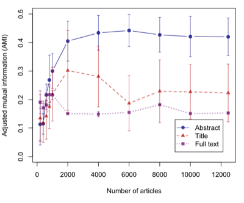
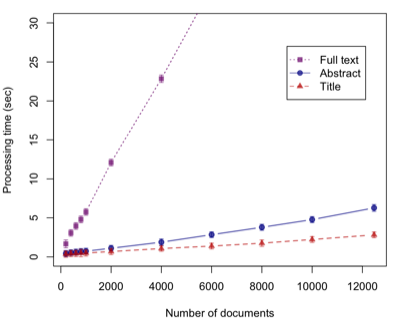

# Data set creation

This document explains how the data set for this project was created (on Feb 26, 2019).  Note that this data set is intended for evaluating cluster quality only; Our exploratory IR system will be using the entire PLOS archive.

## Getting data

Use query "neoplasms by site[MeSH Major Topic]" but restrict the search to PLOS journals as follows. Choose Pubmed and PMC as databases and save the resulting document sets as plos_med.xml and plos_pmc.xml, respectively.

> ("plos one"[Journal] OR "plos pathogens"[Journal] OR "plos neglected tropical diseases"[Journal] OR "plos biology"[Journal] OR "plos medicine"[Journal] OR "plos computational biology"[Journal] OR "plos genetics"[Journal]) AND "neoplasms by site"[MeSH Major Topic]

Compress the data.

```bash
gzip data/plos_med.xml
gzip data/plos_pmc.xml
```

## Deciding which classes to use 

Extract MeSH terms (as well as other textual information).

```bash
python xml2tsv_med.py --input data/plos_med.xml.gz --generalize --major --code | gzip > data/plos_med.txt.gz
```

Check to see what and how many MeSH terms are annotated.

```bash
gzcat data/plos_med.txt.gz | cut -f 4 | perl -npe 's/[\|\+]/\n/g' | sort | uniq -c | sort -nr
5682 Digestive System Neoplasms
2768 Breast Neoplasms
2574 Urogenital Neoplasms
2465 Thoracic Neoplasms
1681 Endocrine Gland Neoplasms
1473 Head and Neck Neoplasms
 836 Nervous System Neoplasms
 321 Skin Neoplasms
 236 Bone Neoplasms
 203 Mammary Neoplasms, Animal
 128 Eye Neoplasms
  89 Hematologic Neoplasms
  51 Abdominal Neoplasms
  35 Soft Tissue Neoplasms
  13 Pelvic Neoplasms
   9 Splenic Neoplasms
```

## Extracting data

Use only top 6 frequent MeSH (by specifying the classes in xml2tsv_med.py).

> classes = {"Digestive System Neoplasms",
>            "Breast Neoplasms",
>            "Urogenital Neoplasms",
>            "Thoracic Neoplasms",
>            "Endocrine Gland Neoplasms",
>            "Head and Neck Neoplasms"}

Run xml2tsv_med.py again with the following options.

```bash
python xml2tsv_med.py --input data/plos_med.xml.gz --generalize --major --code --restrict | gzip > data/plos_med_top6.txt.gz
```

There're 12,530 articles annotated with at least one of the classes.

```bash
gzcat data/plos_med_top6.txt.gz | wc -l  
12530 
```

Here's the distribution of the classes. 

```bash
gzcat data/plos_med_top6.txt | cut -f 4  | perl -npe 's/[\|\+]/\n/g' | sort | uniq -c | sort -nr
4416 Digestive System Neoplasms
2647 Breast Neoplasms
2313 Urogenital Neoplasms
1770 Thoracic Neoplasms
1516 Endocrine Gland Neoplasms
1413 Head and Neck Neoplasms
```

Note that the numbers are different from plos_med.txt because duplicates have been eliminated in creating plos_med_top6.txt.  If we look at the number of lines (articles), they're the same.

```bash
less plos_med.txt | grep "Digestive System Neoplasms" | wc -l
4416
less plos_med_top6.txt | grep "Digestive System Neoplasms" | wc -l
4416
```

## Adding full-text data (body text)

Finally create the data set with full text by adding body text extracted from plos_pmc.xml.

```bash
python xml2tsv_pmc.py --input data/plos_pmc.xml.gz --med data/plos_med_top6.txt.gz | gzip > data/plos_top6.txt.gz
```

Count the number of articles to make sure it didn't change.

```bash
gzcat data/plos_top6.txt.gz | wc -l
   12465
```

## Format

The resulting file, plos_top6.txt, has the following format.

> PMID  Title  Abstract  Body_text  MeSH_terms

The fields are tab-delimted.  If an article is annotated with multiple MeSH terms, the MeSH terms are concatanated with a vertical bar in between (e.g., "MeSH_A|MeSH_B").  The following shows an example article.

> 17951913  Systemic chemotherapy and...  We report a case of...  Choroidal metastases occur most frequently...  Breast Neoplasms, Male
 
## Experiments

Run experiment on title only, title & abstracts, and title & abs & body text.

```sh
bash ./auto_num.sh --fields="title" > output/plos_top6_eval_title.txt
bash ./auto_num.sh --fields="title,abstract" > output/plos_top6_eval_abs.txt
bash ./auto_num.sh --fields="title,abstract,body" > output/plos_top6_eval_all.txt
```

## Results

Extracted AMI and processing time by the following commands.
Used them to draw graphs using R (the R script is found in an Overleaf project as plos2019/figs/graphs.R). 

```sh
less output/plos_top6_eval_title.txt | grep AMI | cut -f3 -d' ' | perl -npe 's/\n/,/'
less output/plos_top6_eval_abs.txt | grep AMI | cut -f3 -d' ' | perl -npe 's/\n/,/'
less output/plos_top6_eval_all.txt | grep AMI | cut -f3 -d' ' | perl -npe 's/\n/,/'

less output/plos_top6_eval_title.txt | grep AMI | cut -f3 -d'(' | perl -npe 's/\)\n/,/'
less output/plos_top6_eval_abs.txt | grep AMI | cut -f3 -d'(' | perl -npe 's/\)\n/,/'
less output/plos_top6_eval_all.txt | grep AMI | cut -f3 -d'(' | perl -npe 's/\)\n/,/'

less output/plos_top6_eval_title.txt | grep Total | cut -f4 -d' ' | perl -npe 's/\n/,/'
less output/plos_top6_eval_abs.txt | grep Total | cut -f4 -d' ' | perl -npe 's/\n/,/'
less output/plos_top6_eval_all.txt | grep Total | cut -f4 -d' ' | perl -npe 's/\n/,/'

less output/plos_top6_eval_title.txt | grep Total | cut -f3 -d'(' | perl -npe 's/\)\n/,/'
less output/plos_top6_eval_abs.txt | grep Total | cut -f3 -d'(' | perl -npe 's/\)\n/,/'
less output/plos_top6_eval_all.txt | grep Total | cut -f3 -d'(' | perl -npe 's/\)\n/,/'
```






## Obsolete

<details><summary>SHOW</summary>

## Experiments

Run experiment on abstracts and full texts.

```bash
nice python eval.py --input data/plos_top6.txt.gz --output output/plos_med_top6_eval_title_sgl.csv -k 6 -f title --single --format full -t -1 --df -1 > log_med_title_sgl.txt &
nice python eval.py --input data/plos_top6.txt.gz --output output/plos_med_top6_eval_sgl.csv -k 6 -f "title,abstract" --single --format full -t -1 --df -1 > log_med_sgl.txt &
nice python eval.py --input data/plos_top6.txt.gz --output output/plos_top6_eval_sgl.csv -k 6 --single --format full -t -1 --df -1 > log_sgl.txt & 
```

### Results on titles

```bash
less output/plos_med_top6_eval_title_sgl.csv | grep ",6,0." | sort -t',' -k13 -nr | head
1,8,1.40,20,kmeans,nan,6,0.6186,0.5500,0.5823,0.5823,0.3667,0.5820,0.5306,0.8768,0.7290,0.2688,0.1492
1,14,0.60,50,kmeans,nan,6,0.5954,0.5539,0.5739,0.5739,0.4283,0.5736,0.5660,0.8081,0.7367,0.1307,0.0954
1,16,1.00,40,kmeans,nan,6,0.5914,0.5526,0.5713,0.5713,0.4325,0.5710,0.5680,0.8067,0.7379,0.1546,0.1059
1,6,0.60,40,kmeans,nan,6,0.5897,0.5481,0.5681,0.5681,0.4207,0.5678,0.5605,0.8976,0.7347,0.1684,0.1112
1,10,0.80,0,kmeans,nan,6,0.5806,0.5388,0.5589,0.5589,0.4028,0.5586,0.5491,0.8990,0.7375,0.0549,0.0458
1,16,1.60,0,kmeans,nan,6,0.5878,0.5298,0.5573,0.5573,0.3111,0.5570,0.4852,0.8334,0.6950,0.1023,0.0727
1,12,1.40,0,kmeans,nan,6,0.5799,0.5355,0.5568,0.5568,0.3135,0.5565,0.4816,0.8215,0.6942,0.0946,0.0696
1,16,1.20,50,kmeans,nan,6,0.5896,0.5252,0.5555,0.5555,0.3236,0.5552,0.4976,0.8350,0.7088,0.1297,0.0994
1,10,1.40,40,kmeans,nan,6,0.5716,0.5364,0.5535,0.5535,0.3749,0.5531,0.5228,0.7763,0.6781,0.1630,0.1138
1,16,1.20,20,kmeans,nan,6,0.5742,0.5323,0.5525,0.5525,0.3171,0.5522,0.4834,0.8138,0.6950,0.2292,0.1338
```

### Results on abstracts

```bash
less output/plos_med_top6_eval_sgl.csv | grep -v "^1,6,0" | grep ",6,0." | sort -t',' -k13 -nr | head
1,16,1.00,40,kmeans,nan,6,0.6419,0.5726,0.6053,0.6053,0.3707,0.6050,0.5333,0.8819,0.7326,0.2169,0.1856
1,16,1.00,10,kmeans,nan,6,0.6413,0.5600,0.5979,0.5979,0.3643,0.5976,0.5338,0.8834,0.7285,0.3893,0.2400
1,16,0.80,30,kmeans,nan,6,0.6361,0.5510,0.5905,0.5905,0.3530,0.5902,0.5273,0.8860,0.7234,0.2397,0.2068
1,14,1.60,40,kmeans,nan,6,0.6273,0.5539,0.5883,0.5883,0.3701,0.5880,0.5356,0.8782,0.7309,0.2767,0.2097
1,10,1.20,20,kmeans,nan,6,0.6272,0.5530,0.5878,0.5878,0.3684,0.5875,0.5348,0.8749,0.7291,0.3607,0.3063
1,12,1.00,40,kmeans,nan,6,0.6299,0.5463,0.5851,0.5851,0.3434,0.5848,0.5201,0.8813,0.7190,0.2437,0.2072
1,16,1.60,20,kmeans,nan,6,0.6082,0.5619,0.5841,0.5841,0.3866,0.5838,0.5383,0.8945,0.7317,0.3300,0.2831
1,10,1.20,40,kmeans,nan,6,0.6031,0.5604,0.5810,0.5810,0.3651,0.5807,0.5188,0.9895,0.7466,0.2868,0.2337
1,8,1.00,20,kmeans,nan,6,0.6149,0.5506,0.5810,0.5810,0.3543,0.5806,0.5203,0.8778,0.7228,0.3864,0.3246
1,10,1.00,40,kmeans,nan,6,0.6227,0.5400,0.5784,0.5784,0.3429,0.5781,0.5198,0.9873,0.7181,0.2724,0.2291
```

### Results on full texts

```bash
less output/plos_top6_eval_sgl.csv | grep ",6,0." | sort -t',' -k13 -nr | head
1,14,1.20,20,kmeans,nan,6,0.5270,0.4613,0.4920,0.4920,0.2139,0.4916,0.4215,0.8207,0.6513,0.2620,0.1781
1,10,0.60,20,kmeans,nan,6,0.5468,0.4345,0.4842,0.4842,0.2184,0.4838,0.4473,0.8550,0.6127,0.1980,0.1851
1,14,1.60,0,kmeans,nan,6,0.5120,0.4588,0.4839,0.4839,0.2370,0.4836,0.4321,0.8116,0.6620,0.2196,0.1467
1,12,1.20,10,kmeans,nan,6,0.5170,0.4535,0.4832,0.4832,0.2010,0.4828,0.4117,0.8205,0.6445,0.3144,0.2460
1,16,1.40,0,kmeans,nan,6,0.5141,0.4531,0.4816,0.4816,0.2229,0.4813,0.4259,0.9737,0.6537,0.1632,0.1146
1,14,1.20,40,kmeans,nan,6,0.5289,0.4366,0.4784,0.4784,0.2061,0.4780,0.4289,0.8319,0.6394,0.1911,0.1591
1,12,1.20,0,kmeans,nan,6,0.5123,0.4455,0.4766,0.4766,0.2011,0.4762,0.4137,0.8219,0.6448,0.1844,0.1398
1,12,0.80,10,kmeans,nan,6,0.5119,0.4444,0.4758,0.4758,0.2065,0.4754,0.4178,0.8200,0.6461,0.3068,0.2050
1,12,1.20,20,kmeans,nan,6,0.5107,0.4439,0.4750,0.4750,0.1943,0.4746,0.4089,0.8252,0.6411,0.2631,0.1922
1,8,0.60,20,kmeans,nan,6,0.5134,0.4353,0.4711,0.4711,0.1797,0.4707,0.4045,0.8274,0.6323,0.2344,0.2065
```

## Sample size and cluster quality

### for titles
```bash
# sample=0 means 'use all'
for i in 100 200 400 600 800 1000 2000 4000 6000 8000 10000 0; do
  echo -n $i
  nice python visual_library.py -i data/plos_top6.txt.gz --single --format full --fields title --clustering kmeans --svd 20 -r 8 -d 1.4 -k 6 --sample $i | grep A-MI
done
100 A-MI         = 0.320289
200 A-MI         = 0.203923
400 A-MI         = 0.085942
600 A-MI         = 0.233143
800 A-MI         = 0.416032
1000 A-MI         = 0.496599
2000 A-MI         = 0.623462
4000 A-MI         = 0.538047
6000 A-MI         = 0.487626
8000 A-MI         = 0.560157
10000 A-MI         = 0.519458
0 A-MI         = 0.581956

# make title only data
less data/plos_top6.txt.gz | perl -ne '@a=split(/\t/);print("$a[0]\t$a[1]\t\t\t$a[4]")' | gzip > data/plos_top6_title.txt.gz
# measure
for i in 100 200 400 600 800 1000 2000 4000 6000 8000 10000 0; do   echo -n "$i ";   nice python visual_library.py -i data/plos_top6_title.txt.gz --single --format full --fields title --clustering kmeans --svd 20 -r 8 -d 1.4 -k 6 --sample $i | grep "Processing time"; done 
100 Processing time (sec): 0.06934070587158203
200 Processing time (sec): 0.21411657333374023
400 Processing time (sec): 0.2160656452178955
600 Processing time (sec): 0.24439454078674316
800 Processing time (sec): 0.27433323860168457
1000 Processing time (sec): 0.3233377933502197
2000 Processing time (sec): 0.42231249809265137
4000 Processing time (sec): 0.7704150676727295
6000 Processing time (sec): 1.236863613128662
8000 Processing time (sec): 1.9074664115905762
10000 Processing time (sec): 2.7687151432037354
0 Processing time (sec): 3.2354702949523926
```

### for titles and abstracts
```bash

# sample=0 means 'use all'
for i in 100 200 400 600 800 1000 2000 4000 6000 8000 10000 0; do
  echo -n $i
  nice python visual_library.py -i data/plos_top6.txt.gz --single --format full --fields title,abs --clustering kmeans --svd 40 -r 16 -d 1.0 -k 6 --sample $i | grep A-MI
done
100 A-MI         = 0.377786
200 A-MI         = 0.335321
400 A-MI         = 0.265791
600 A-MI         = 0.492016
800 A-MI         = 0.518745
1000 A-MI         = 0.587677
2000 A-MI         = 0.595761
4000 A-MI         = 0.547354
6000 A-MI         = 0.590048
8000 A-MI         = 0.477772
10000 A-MI         = 0.551990
0 A-MI         = 0.587466

for i in 100 200 400 600 800 1000 2000 4000 6000 8000 10000 0; do
  echo -n "$i "
  nice python visual_library.py -i data/plos_top6_abs.txt.gz --single --format full --fields title,abs --clustering kmeans --svd 20 -r 10 -d 1.2 -k 6 --sample $i | grep "Processing time"
done
100 Processing time (sec): 0.2009420394897461
200 Processing time (sec): 0.23556756973266602
400 Processing time (sec): 0.376389741897583
600 Processing time (sec): 0.37632226943969727
800 Processing time (sec): 0.42809462547302246
1000 Processing time (sec): 0.522179126739502
2000 Processing time (sec): 0.8164660930633545
4000 Processing time (sec): 1.546290397644043
6000 Processing time (sec): 2.484266519546509
8000 Processing time (sec): 3.6278839111328125
10000 Processing time (sec): 4.822795629501343
0 Processing time (sec): 5.5005409717559814
```

### for full text
```bash
1,14,1.20,20,kmeans,nan,6,0.5270,0.4613,0.4920,0.4920,0.2139,0.4916,0.4215,0.8207,0.6513,0.2620,0.1781

# sample=0 means 'use all'
for i in 100 200 400 600 800 1000 2000 4000 6000 8000 10000 0; do
  echo -n $i
  nice python visual_library.py -i data/plos_top6.txt.gz --single --format full --fields title,abs,body --clustering kmeans --svd 20 -r 14 -d 1.2 -k 6 --sample $i | grep A-MI
done
100 A-MI         = 0.295346
200 A-MI         = 0.196831
400 A-MI         = 0.099206
600 A-MI         = 0.303481
800 A-MI         = 0.187155
1000 A-MI         = 0.261142
2000 A-MI         = 0.469417
4000 A-MI         = 0.326718
6000 A-MI         = 0.387437
8000 A-MI         = 0.366588
10000 A-MI         = 0.278852
0 A-MI         = 0.491601

for i in 100 200 400 600 800 1000 2000 4000 6000 8000 10000 0; do   
  echo -n "$i ";   
  nice python visual_library.py -i data/plos_top6.txt.gz --single --format full --fields title,abs,body --clustering kmeans --svd 20 -r 14 -d 1.2 -k 6 --sample $i | grep "Processing time"; 
done
100 Processing time (sec): 0.6615867614746094
200 Processing time (sec): 1.606123447418213
400 Processing time (sec): 2.90543794631958
600 Processing time (sec): 3.7888309955596924
800 Processing time (sec): 4.599233388900757
1000 Processing time (sec): 5.7834179401397705
2000 Processing time (sec): 11.545138597488403
4000 Processing time (sec): 21.9506356716156
6000 Processing time (sec): 32.561360359191895
8000 Processing time (sec): 43.7649130821228
10000 Processing time (sec): 54.45869064331055
0 Processing time (sec): 60.54986906051636
```
 
### Results on titles

```bash
less data/plos_med_top6_eval_title_sgl.csv | grep ",6,0." | sort -t',' -k13 -nr | head
1,7,1.00,0,kmeans,nan,6,0.6786,0.4959,0.5731,0.5731,0.2846,0.5721,0.4646,0.8561,0.6408,0.1305,-0.0035
1,6,0.90,16,kmeans,nan,6,0.6367,0.4692,0.5402,0.5402,0.2212,0.5392,0.4171,0.8476,0.6171,0.3161,0.0604
1,10,0.50,0,kmeans,nan,6,0.6100,0.4683,0.5298,0.5298,0.3139,0.5288,0.4760,0.7755,0.6474,0.0390,-0.0000
1,7,0.50,20,kmeans,nan,6,0.6137,0.4652,0.5292,0.5292,0.3053,0.5282,0.4724,0.9078,0.6411,0.1982,-0.0307
1,5,0.90,4,kmeans,nan,6,0.5747,0.4851,0.5261,0.5261,0.3710,0.5248,0.5229,0.7566,0.6588,0.8927,-0.7455
1,5,0.90,0,spectral,nan,6,0.5867,0.4762,0.5257,0.5257,0.4292,0.5244,0.5731,0.2839,0.6536,0.9855,-0.5769
1,5,0.90,0,kmeans,nan,6,0.5850,0.4752,0.5244,0.5244,0.4280,0.5231,0.5720,0.7554,0.6530,0.9861,-0.5769
1,6,0.60,20,kmeans,nan,6,0.5936,0.4672,0.5229,0.5229,0.3231,0.5219,0.4771,0.7607,0.6476,0.2351,-0.0026
1,5,0.90,0,maximin,0.80,6,0.5825,0.4730,0.5221,0.5221,0.4272,0.5207,0.5715,0.7696,0.6526,0.9834,-0.5769
1,6,0.80,20,maximin,0.99,7,0.5440,0.4961,0.5189,0.5189,0.4097,0.5178,0.5170,0.7051,0.6432,0.2889,0.0215
```

### Results on abstracts

```bash
less data/plos_med_top6_eval_sgl.csv | grep ",6,0." | sort -t',' -k13 -nr | grep -v maximin | head
1,5,1.00,16,kmeans,nan,6,0.7481,0.6328,0.6856,0.6856,0.5398,0.6849,0.6392,0.9773,0.7479,0.6054,0.5247
1,5,1.00,0,kmeans,nan,6,0.7477,0.6324,0.6852,0.6852,0.5388,0.6845,0.6385,0.8416,0.7478,0.5936,0.4974
1,5,0.90,0,kmeans,nan,6,0.7423,0.6226,0.6772,0.6772,0.5197,0.6765,0.6245,0.8424,0.7406,0.5719,0.4743
1,6,1.00,0,kmeans,nan,6,0.7312,0.6253,0.6741,0.6741,0.5420,0.6734,0.6373,0.8056,0.7503,0.5563,0.4431
1,5,1.00,8,spectral,nan,6,0.7474,0.5965,0.6635,0.6635,0.4939,0.6627,0.6162,0.8614,0.7414,0.6521,0.5395
1,5,1.00,8,kmeans,nan,6,0.7198,0.6136,0.6624,0.6624,0.5221,0.6617,0.6235,0.8007,0.7373,0.6580,0.5395
1,5,1.00,12,kmeans,nan,6,0.7181,0.6107,0.6601,0.6601,0.5161,0.6593,0.6193,0.8088,0.7336,0.6301,0.5086
1,5,0.90,12,spectral,nan,6,0.7451,0.5893,0.6581,0.6581,0.4789,0.6573,0.6059,0.8626,0.7351,0.5995,0.4785
1,5,0.90,8,spectral,nan,6,0.7427,0.5868,0.6556,0.6556,0.4755,0.6548,0.6035,0.8617,0.7336,0.6058,0.4485
1,5,0.90,16,spectral,nan,6,0.7427,0.5861,0.6552,0.6552,0.4756,0.6544,0.6038,0.8623,0.7334,0.5797,0.5078
```

### Results on full texts

```bash
less data/plos_top6_eval_sgl.csv | grep ",6,0." | sort -t',' -k13 -nr | head
1,10,0.60,20,kmeans,nan,6,0.5468,0.4345,0.4842,0.4842,0.2184,0.4838,0.4473,0.8550,0.6127,0.1980,0.1851
1,10,0.80,12,kmeans,nan,6,0.5203,0.4485,0.4817,0.4817,0.1963,0.4813,0.4125,0.8270,0.6414,0.2806,0.2447
1,10,0.80,16,kmeans,nan,6,0.5203,0.4468,0.4808,0.4808,0.1948,0.4804,0.4122,0.8256,0.6403,0.2641,0.2033
1,10,0.90,0,kmeans,nan,6,0.5230,0.4329,0.4737,0.4737,0.1984,0.4733,0.4231,0.8282,0.6381,0.1699,0.1309
1,9,0.60,12,kmeans,nan,6,0.5114,0.4385,0.4721,0.4721,0.1914,0.4717,0.4100,0.8246,0.6378,0.2667,0.2321
1,8,0.60,20,kmeans,nan,6,0.5134,0.4353,0.4711,0.4711,0.1797,0.4707,0.4045,0.8274,0.6323,0.2344,0.2065
1,8,0.60,16,kmeans,nan,6,0.5127,0.4343,0.4703,0.4703,0.1769,0.4699,0.4028,0.8224,0.6306,0.2538,0.2059
1,9,0.60,16,kmeans,nan,6,0.5115,0.4345,0.4699,0.4699,0.1817,0.4695,0.4055,0.9909,0.6332,0.2486,0.1981
1,10,0.90,16,kmeans,nan,6,0.5080,0.4351,0.4687,0.4687,0.1765,0.4683,0.3998,0.8251,0.6310,0.2701,0.2099
1,9,1.00,0,kmeans,nan,6,0.4985,0.4406,0.4678,0.4678,0.2042,0.4674,0.4119,0.8085,0.6448,0.2093,0.1528
```

</details>
