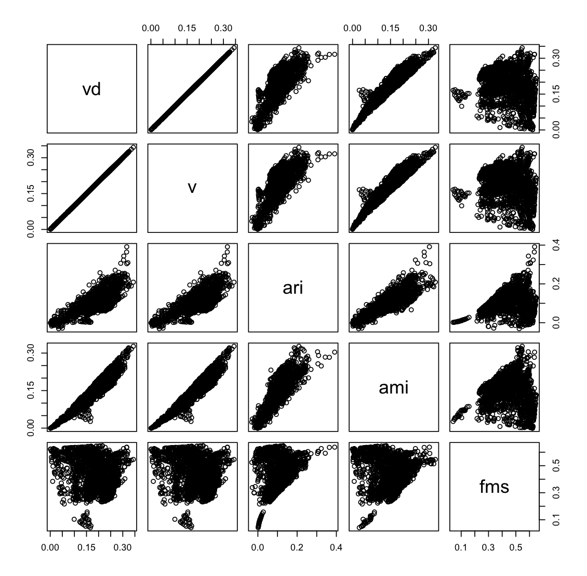

# Data preparation

Got articles for the query "**breast neoplasms[MeSH Major Topic]**" from pubmed on September 21, 2018 and saved as brca_med.xml.  

- brca_med.xml contains 224,940 articles.  

Did the same for pmc (as pmc doesn't give mesh terms) and save as brca_pmc.xml. 

- brca_pmc.xml contains 39,332 articles.

So, 39,332 / 224,940 = 17.5% of the articles have full texts.

Look at the mesh term distribution. Note that only major mesh terms are considered (--major) and mesh terms are generalized (--generalize) up to the level specified by **target_mesh** variable in xml2tsv_med.py. 

```bash
python xml2tsv_med.py --input data/brca_med.xml.gz --generalize --major --code > brca_med.txt

cut -f 4 brca_med.txt | perl -npe 's/\|/\n/g' | sort | uniq -c | sort -nr | less
  11115 Carcinoma, Ductal, Breast
   3475 Carcinoma, Lobular
   2588 Triple Negative Breast Neoplasms
   1955 Breast Neoplasms, Male
    342 Inflammatory Breast Neoplasms
    155 Hereditary Breast and Ovarian Cancer Syndrome
    100 Unilateral Breast Neoplasms
     61 Breast Carcinoma In Situ
```

Use only top 4 frequent MeSH. (Specify **classes** variables as follows in extract.py.)

> classes = {"Carcinoma, Ductal, Breast",
>            "Carcinoma, Lobular",
>            "Triple Negative Breast Neoplasms",
>            "Breast Neoplasms, Male"}

Run extract.py again.  (Later found that --major didn't make difference since there were no MeSH terms under the top four MeSH terms in the MeSH tree.  So, --major and --code may be omitted.)

```bash
python xml2tsv_med.py --input data/brca_med.xml.gz --generalize --major --code --restrict > brca_med_top4.txt
```

This results in 16,576 articles annotated with at least one of the four mesh terms.

```bash
wc -l brca_med_top4.txt 
16576 brca_med_top4.txt
```

Make sure the distribution of the classes is the same as the above but only top four terms.

```bash
cut -f 4 brca_med_top4.txt | perl -npe 's/[\|\+]/\n/g' | sort | uniq -c | sort -nr
  11115 Carcinoma, Ductal, Breast
   3475 Carcinoma, Lobular
   2588 Triple Negative Breast Neoplasms
   1955 Breast Neoplasms, Male
```

Finally create the data set with full text by adding body text extracted from plos_pmc.xml.

```bash
python xml2tsv_pmc.py > brca_pmc_top4.txt
```

Count the number of articles and look at the distribution of classes.

```bash
wc -l brca_pmc_top4.txt
1932 brca_pmc_top4.txt

cut -f 5 brca_pmc_top4.txt | perl -npe 's/\|/\n/g' | sort | uniq -c | sort -nr
    935 Carcinoma, Ductal, Breast
    824 Triple Negative Breast Neoplasms
    290 Carcinoma, Lobular
    141 Breast Neoplasms, Male
```

# Experiments

## Abstracts (larger data)

Run an evaluation script for medline data created above. Different combinations of parameters are executed. (It takes about 10 hours to complete.)

```bash
python eval.py --input brca_med_top4.txt.gz --output brca_med_top4_eval.csv
```

The resulting file has a set of given parameters and evaluation metric values for each line in the following order:

> df,r,d,n,k,c,h,vd,v,ari,ami,fms

where 

- df is a df cutoff threshold (words with document frequency equal or smaller than df are ignored)
- r and d are VCGS's parameters
- n is the number of dimensions (components) for SVD
- alg is an clustering algorithm (kmeans or maximin)
- k is the number of clusters
- the rest are evaluation measures: c = completeness, h = homogeneity, vd = v-measure-d, v = v-measure, ari = adjusted rand index, ami = adjusted mutual information, and fms = Fowlkes-Mallows index.  

Notes:

- v-measure-d and v-measure are different in how to treat multi-label cases.  The former treats (A, M1) and (A, M2) with evenly divided importance in evaluation, and the latter treats them as independent instances in evaluation.
- When df is greater than 1, VCGS is not applied.  This is for investigating the effectiness of VCGS in comparison with DF-based feature selection.

Now let's look at the five best parameter combinations based on adjusted rand index (ari).

```bash
less brca_med_top4_eval.csv | sort -t',' -k11 -nr | head -5
1,9,0.14,20,kmeans,4,0.3716,0.2526,0.3007,0.2714,0.2520,0.2272,0.6318
1,9,0.53,6,kmeans,4,0.4038,0.2605,0.3167,0.2860,0.2484,0.2328,0.6405
1,9,0.53,20,kmeans,4,0.3995,0.2559,0.3120,0.2815,0.2446,0.2286,0.6394
1,9,0.53,8,kmeans,4,0.3994,0.2554,0.3115,0.2813,0.2435,0.2282,0.6392
1,9,0.53,12,kmeans,4,0.3992,0.2550,0.3113,0.2809,0.2430,0.2278,0.6392
```

Observations:

- df = 1 dominates the top ranked ones, which means VCGS is better than DF-based feature selection.
- kmeans works better than maximin.
- r = 9, d = 0.53 worked generally good. More investigation is needed to see if performance is sensitive to these parameters (it's not a very good property if it is).
- SVD seems to be effective but the number of components (n) doesn't seem to have a clear association with the performance.
- k = 4 worked consistently good, which is expected as we have four underlying classes (mesh terms)

Based on the first observation above, let's see how good the DF-based feature selection is.  The following shows the five best results in ari where minimum DF was set to other than 1.

```bash
# any number of clusters
less brca_med_top4_eval.csv | grep -vP '^1,' | sort -t',' -k11 -nr | head -5
100,na,na,20,kmeans,16,0.1047,0.1051,0.1049,0.0926,0.0921,0.0911,0.5172
10,na,na,6,kmeans,8,0.1332,0.1768,0.1519,0.1367,0.0868,0.1195,0.4008
100,na,na,18,kmeans,14,0.0969,0.1065,0.1015,0.0891,0.0850,0.0853,0.4834
70,na,na,14,kmeans,8,0.1106,0.0952,0.1024,0.0913,0.0844,0.0832,0.5005
50,na,na,10,kmeans,8,0.1199,0.1018,0.1101,0.0983,0.0807,0.0891,0.4897

# number of clusters = 4
less brca_med_top4_eval.csv | grep -vP '^1,' | grep ',4,0' | sort -t',' -k11 -nr | head -5
100,na,na,6,kmeans,4,0.1158,0.0837,0.0972,0.0881,0.0806,0.0745,0.5135
70,na,na,20,kmeans,4,0.1563,0.0840,0.1093,0.0992,0.0801,0.0749,0.5471
100,na,na,0,kmeans,4,0.1049,0.0815,0.0918,0.0824,0.0782,0.0720,0.5049
70,na,na,6,kmeans,4,0.1202,0.0855,0.1000,0.0898,0.0745,0.0755,0.5023
50,na,na,4,kmeans,4,0.1248,0.0924,0.1062,0.0956,0.0724,0.0819,0.4929
```

The best ari was found to be 0.0921, which is pretty low.  So VCGS does work!  

What if we look at v-measure-d?

```bash
less brca_med_top4_eval.csv | sort -t',' -k9 -nr | head -5
1,8,0.27,16,kmeans,6,0.3185,0.3468,0.3320,0.2873,0.2306,0.2763,0.5525
1,8,0.53,20,kmeans,4,0.3501,0.3154,0.3318,0.2948,0.2256,0.2762,0.5641
1,9,0.53,6,kmeans,4,0.4038,0.2605,0.3167,0.2860,0.2484,0.2328,0.6405
1,8,0.34,14,kmeans,4,0.3364,0.2984,0.3163,0.2820,0.2293,0.2624,0.5711
1,9,0.47,4,kmeans,4,0.4247,0.2485,0.3136,0.2836,0.2422,0.2223,0.6498
```

Observations:

- Overall, we see similar patterns to ari.
- df = 1 still works better (VCGS is better).
- r is more stable than d.
- kmeans still works better.
- k = 4 still generally works better, which is not expected as v-measure tends to increase with the cluster number.

## Full texts vs. abstracts (smaller data)

First, run eval.py script. (We can run them in parallel as follows. Takes about a couple of hours.)

```bash
python eval.py --input brca_pmc_top4.txt.gz --output brca_top4_eval_all.csv &

python eval.py --input brca_pmc_top4.txt.gz --fields title,abstract --output brca_top4_eval_ta.csv &

python eval.py --input brca_pmc_top4.txt.gz --fields title --output brca_top4_eval_t.csv &
```

Let's look at the result based on ARI.

```bash
# Evaluation for title+abstract+fulltext
less brca_top4_eval_all.csv | sort -t',' -k11 -nr | head -5
1,8,0.08,6,kmeans,6,0.3104,0.3016,0.3060,0.2841,0.3218,0.2758,0.5726
1,8,0.08,2,kmeans,2,0.4135,0.2514,0.3127,0.2923,0.3038,0.2314,0.5993
1,8,0.08,14,kmeans,4,0.3456,0.2517,0.2913,0.2742,0.2997,0.2320,0.5862
1,8,0.08,12,kmeans,4,0.3281,0.2590,0.2895,0.2666,0.2869,0.2364,0.5684
1,8,0.08,18,kmeans,6,0.3009,0.2702,0.2847,0.2635,0.2819,0.2467,0.5575

# Evaluation for title+abstract.
less brca_top4_eval_ta.csv | sort -t',' -k11 -nr | head -5
1,8,0.01,2,kmeans,2,0.3843,0.2324,0.2896,0.2684,0.2760,0.2117,0.5850
1,8,0.08,2,kmeans,2,0.3866,0.2335,0.2912,0.2691,0.2753,0.2121,0.5849
1,8,0.27,2,kmeans,2,0.4062,0.2400,0.3017,0.2789,0.2743,0.2175,0.5913
1,8,0.21,2,kmeans,2,0.3926,0.2328,0.2923,0.2683,0.2673,0.2096,0.5861
1,8,0.34,2,kmeans,2,0.4034,0.2360,0.2978,0.2763,0.2652,0.2144,0.5888

# Evaluation for title.
less brca_top4_eval_t.csv | sort -t',' -k11 -nr | head -5
1,8,0.01,2,maximin,2,0.3032,0.1764,0.2230,0.2009,0.2156,0.1574,0.5529
1,8,0.08,2,maximin,2,0.3033,0.1764,0.2230,0.2005,0.2150,0.1571,0.5526
1,8,0.14,2,maximin,2,0.3014,0.1747,0.2212,0.1984,0.2124,0.1552,0.5517
1,8,0.21,2,maximin,2,0.2992,0.1731,0.2193,0.1970,0.2099,0.1540,0.5507
1,8,0.27,2,maximin,2,0.2891,0.1633,0.2087,0.1868,0.1908,0.1449,0.5443
```

Observations:

- Using all fields (title+abstract+fulltext) achieved the best performance in ari, followed by title+abs, then title.
- Optimum cluster number (k) became more incoherent for title+abstract+fulltext and smaller (k = 2) for title+abs and title. It may be because the data set is small and it's more difficult to identify underlying clusters.
- When using only titles, maximin clustering worked better than kmeans.

Since we know there're four classes in advance, it would be more appropriate to compare the three cases above only for four clusters (i.e., only look at k=4).

```bash
# Evaluation for title+abstract+fulltext
less brca_top4_eval_all.csv | grep ",4,0." | sort -t',' -k11 -nr | head -5
1,8,0.08,14,kmeans,4,0.3456,0.2517,0.2913,0.2742,0.2997,0.2320,0.5862
1,8,0.08,12,kmeans,4,0.3281,0.2590,0.2895,0.2666,0.2869,0.2364,0.5684
1,8,0.08,16,kmeans,4,0.3160,0.2356,0.2700,0.2479,0.2732,0.2152,0.5635
1,8,0.08,8,kmeans,4,0.3086,0.2430,0.2719,0.2523,0.2519,0.2229,0.5501
1,8,0.40,20,kmeans,4,0.3815,0.3101,0.3421,0.3114,0.2416,0.2780,0.5567

# Evaluation for title+abstract.
less brca_top4_eval_ta.csv | grep ",4,0." | sort -t',' -k11 -nr | head -5
1,8,0.08,0,kmeans,4,0.3352,0.3164,0.3255,0.2991,0.2259,0.2845,0.5168
1,8,0.01,18,kmeans,4,0.3139,0.2934,0.3033,0.2800,0.2223,0.2655,0.5127
1,8,0.01,16,kmeans,4,0.3107,0.2901,0.3000,0.2771,0.2179,0.2626,0.5103
1,8,0.01,20,kmeans,4,0.3087,0.2869,0.2974,0.2763,0.2117,0.2611,0.5081
1,8,0.01,0,kmeans,4,0.2631,0.2659,0.2645,0.2426,0.2091,0.2395,0.4856

# Evaluation for title.
less brca_top4_eval_t.csv | grep ",4,0." | sort -t',' -k11 -nr | head -5
1,8,0.21,6,maximin,4,0.1658,0.1809,0.1730,0.1551,0.1767,0.1488,0.4460
1,9,0.01,10,kmeans,4,0.1512,0.1241,0.1363,0.1248,0.1396,0.1115,0.4737
1,8,0.14,20,kmeans,4,0.2283,0.2054,0.2163,0.2035,0.1357,0.1857,0.4850
1,8,0.01,4,kmeans,4,0.2132,0.2031,0.2080,0.1900,0.1241,0.1802,0.4532
1,8,0.08,10,maximin,4,0.1481,0.1602,0.1539,0.1384,0.1224,0.1327,0.4090
```

Observations:

- The tendency (fulltext > abstract > title) didn't change.
- maximin still works better for title.
- The ari values for abstract+title (0.2259 at the maximum) is similar to the case for the larger data (medline) (0.2520), so we can expect that using full-text data would improve ari for the larger data, too, if they were available. 

What if we look at v-measure-d?

```bash
# Evaluation for title+abstract+fulltext
less brca_top4_eval_all.csv | grep ",4,0." | sort -t',' -k9 -nr | head -5
1,8,0.40,20,kmeans,4,0.3815,0.3101,0.3421,0.3114,0.2416,0.2780,0.5567
1,8,0.34,18,kmeans,4,0.3774,0.3041,0.3368,0.3058,0.2346,0.2721,0.5540
1,8,0.34,16,kmeans,4,0.3669,0.2999,0.3300,0.2982,0.2413,0.2673,0.5535
1,8,0.21,20,kmeans,4,0.3550,0.2804,0.3133,0.2858,0.2308,0.2525,0.5512
1,8,0.27,20,kmeans,4,0.3505,0.2792,0.3108,0.2809,0.2236,0.2489,0.5472

# Evaluation for title+abstract.
less brca_top4_eval_ta.csv | grep ",4,0." | sort -t',' -k9 -nr | head -5
1,8,0.08,0,kmeans,4,0.3352,0.3164,0.3255,0.2991,0.2259,0.2845,0.5168
1,8,0.21,18,kmeans,4,0.3214,0.3099,0.3156,0.2891,0.2064,0.2775,0.5001
1,8,0.21,20,kmeans,4,0.3200,0.3069,0.3133,0.2872,0.2046,0.2751,0.5001
1,8,0.60,16,kmeans,4,0.3092,0.3159,0.3125,0.2862,0.1938,0.2825,0.4773
1,8,0.60,18,kmeans,4,0.3080,0.3142,0.3110,0.2849,0.1900,0.2809,0.4755

# Evaluation for title.
less brca_top4_eval_t.csv | grep ",4,0." | sort -t',' -k9 -nr | head -5
1,8,0.53,20,kmeans,4,0.2328,0.2424,0.2375,0.2183,0.0958,0.2157,0.4236
1,8,0.14,20,kmeans,4,0.2283,0.2054,0.2163,0.2035,0.1357,0.1857,0.4850
1,8,0.14,0,kmeans,4,0.2213,0.2091,0.2151,0.1963,0.1136,0.1853,0.4501
1,8,0.40,10,kmeans,4,0.2201,0.2064,0.2130,0.1945,0.1037,0.1831,0.4466
1,8,0.08,8,kmeans,4,0.2179,0.2056,0.2115,0.1939,0.1159,0.1830,0.4512
```

Observations:

- The tendency didn't change (fulltext > abstract > title) but the differences between fulltext between abstract became smaller.
- r is stable and d is not.
- larger n may need to be explored.

### Evaluate only single-class instances

Some articles are annotated with multiple MeSH terms (out of the four MeSH terms we're focusing on).  They lower the performance to some extent, so let's see how much it improves if we exclude them.

```bash
python eval.py --input brca_pmc_top4.txt.gz --output brca_top4_eval_all_sgl.csv --single &
python eval.py --input brca_pmc_top4.txt.gz --fields title,abstract --output brca_top4_eval_ta_sgl.csv --single &
python eval.py --input brca_pmc_top4.txt.gz --fields title --output brca_top4_eval_t_sgl.csv --single &
```

Here's the disribution of MeSH terms (and their combinations).  For this experiment, we use only single-class instances (i.e., "124 Breast Neoplasms, Male" and "687 Carcinoma, Ductal, Breast", ...).

```bash
less brca_pmc_top4.txt.gz | cut -f5 | sort | uniq -c
    124 Breast Neoplasms, Male
     15 Breast Neoplasms, Male|Carcinoma, Ductal, Breast
      1 Breast Neoplasms, Male|Carcinoma, Ductal, Breast|Carcinoma, Lobular
      1 Breast Neoplasms, Male|Triple Negative Breast Neoplasms
    687 Carcinoma, Ductal, Breast
    193 Carcinoma, Ductal, Breast|Carcinoma, Lobular
     88 Carcinoma, Lobular
    783 Triple Negative Breast Neoplasms
     32 Triple Negative Breast Neoplasms|Carcinoma, Ductal, Breast
      7 Triple Negative Breast Neoplasms|Carcinoma, Ductal, Breast|Carcinoma, Lobular
      1 Triple Negative Breast Neoplasms|Carcinoma, Lobular
```

Here's the top five parameter settings in ari.

```bash
# Evaluation for title+abstract+fulltext
less brca_top4_eval_all_sgl.csv | grep ",4,0." | sort -t',' -k11 -nr | head -5
1,8,0.08,4,kmeans,4,0.3281,0.3056,0.3164,0.3164,0.3914,0.3038,0.6372
1,8,0.08,8,kmeans,4,0.3542,0.2850,0.3159,0.3159,0.3644,0.2831,0.6352
1,8,0.08,16,kmeans,4,0.3567,0.2922,0.3212,0.3212,0.3095,0.2903,0.6041
1,8,0.08,10,kmeans,4,0.3326,0.2593,0.2914,0.2914,0.3062,0.2573,0.6064
1,8,0.01,0,kmeans,4,0.3267,0.3071,0.3166,0.3166,0.3041,0.3053,0.5906

# Evaluation for title+abstract.
less brca_top4_eval_ta_sgl.csv | grep ",4,0." | sort -t',' -k11 -nr | head -5
1,8,0.27,8,kmeans,4,0.3880,0.3374,0.3609,0.3609,0.3393,0.3356,0.6166
1,9,0.14,0,kmeans,4,0.2534,0.2636,0.2584,0.2584,0.2803,0.2516,0.5654
1,9,0.14,6,kmeans,4,0.3378,0.2837,0.3084,0.3084,0.2715,0.2818,0.5899
1,8,0.01,20,kmeans,4,0.3357,0.3300,0.3328,0.3328,0.2705,0.3282,0.5601
1,8,0.01,16,kmeans,4,0.3345,0.3283,0.3314,0.3314,0.2684,0.3265,0.5597

# Evaluation for title.
less brca_top4_eval_t_sgl.csv | grep ",4,0." | sort -t',' -k11 -nr | head -5
1,8,0.21,0,kmeans,4,0.2379,0.2503,0.2439,0.2439,0.1793,0.2361,0.4925
1,8,0.08,8,kmeans,4,0.2319,0.2372,0.2345,0.2345,0.1680,0.2299,0.4922
1,8,0.34,12,maximin,4,0.1671,0.2063,0.1846,0.1846,0.1610,0.1654,0.4434
1,8,0.08,2,kmeans,4,0.2206,0.2353,0.2277,0.2277,0.1610,0.2187,0.4800
1,8,0.01,2,kmeans,4,0.2197,0.2341,0.2267,0.2267,0.1598,0.2178,0.4795
```

The ari values are increased up to 0.3914.  Although the data size becomes smaller, the results are consistent with the previous ones, so it'll be better to use this data set (for presentation).

Run evaluation script for the medline data, too.

```bash
python eval.py --input brca_med_top4.txt.gz --output brca_med_top4_eval_sgl.csv --single
```

# Evaluation metrics

Need to consider which metric is suitable for our purpose.
Here's my thought.

- V-measure:  Not suitable to measure cluster quality as it doesn't 
	take into account random labeling.

- Fowlkes-Mallows scores:  Not suitable as it doesn't consider true 
	negatives (pairs not in the same clusters in the predictions and
	in the ground truth).

- Adjusted mutual information: Preferred as it's adjusted against chance
	although it focuses on agreements (intersections) of true and predicted
	clusters.

- Adjusted Rand index:  Desirable as it's adjusted against chance and
	consider not only true positives but also true negatives.  I think it's 
	important to consider true negatives as it indicates cluster separation.

So, AMI and ARI would be the candidates of our evaluation metrics. If we look at the results above sorted by AMI, the tendency changes (i.e., title+abstract > title+abstract+fulltext > title).  The difference may be due to the fact ARI looks at true negatives (hence cluster separation) and full-text data helped to separate different underlying classes. 

```bash
less brca_top4_eval_all_sgl.csv | grep ",4,0." | sort -t',' -k12 -nr | head -5
1,8,0.53,12,kmeans,4,0.3598,0.3289,0.3437,0.3437,0.2091,0.3272,0.5464
1,8,0.47,14,kmeans,4,0.3228,0.3254,0.3241,0.3241,0.1852,0.3211,0.5141
1,8,0.53,0,kmeans,4,0.3272,0.3204,0.3238,0.3238,0.2196,0.3187,0.5390
1,8,0.47,16,kmeans,4,0.3542,0.3181,0.3352,0.3352,0.1891,0.3163,0.5401
1,8,0.53,10,kmeans,4,0.3237,0.3171,0.3204,0.3204,0.2294,0.3154,0.5438

less brca_top4_eval_ta_sgl.csv | grep ",4,0." | sort -t',' -k12 -nr | head -5
1,8,0.27,8,kmeans,4,0.3880,0.3374,0.3609,0.3609,0.3393,0.3356,0.6166
1,8,0.34,16,kmeans,4,0.3350,0.3546,0.3445,0.3445,0.2182,0.3334,0.5167
1,8,0.60,0,kmeans,4,0.3341,0.3589,0.3461,0.3461,0.2192,0.3326,0.5139
1,8,0.27,12,kmeans,4,0.3339,0.3508,0.3422,0.3422,0.2305,0.3323,0.5261
1,8,0.34,18,kmeans,4,0.3317,0.3499,0.3406,0.3406,0.2171,0.3301,0.5170

$ less brca_top4_eval_t_sgl.csv | grep ",4,0." | sort -t',' -k12 -nr | head -5
1,8,0.60,0,kmeans,4,0.2485,0.2868,0.2663,0.2663,0.1266,0.2468,0.4439
1,8,0.21,0,kmeans,4,0.2379,0.2503,0.2439,0.2439,0.1793,0.2361,0.4925
1,8,0.34,20,kmeans,4,0.2377,0.2719,0.2536,0.2536,0.1141,0.2360,0.4387
1,8,0.21,6,kmeans,4,0.2368,0.2425,0.2396,0.2396,0.1536,0.2349,0.4855
1,8,0.14,12,kmeans,4,0.2322,0.2340,0.2331,0.2331,0.1334,0.2302,0.4783
```

To see their difference empirically, the following computes Pearson's correlation coefficient between every pair of metrics.

```R
> cls <- c(ari="numeric", ami="numeric", vd="numeric",v="numeric",fms="numeric") 
> x = read.csv("brca_top4_eval_all.csv",header=TRUE,colClasses=cls) 
> cor(x[,9:13])
            vd          v        ari        ami         fms
vd   1.0000000  0.9991308 0.82446750  0.9642236 -0.33461550
v    0.9991308  1.0000000 0.82628264  0.9628118 -0.33898520
ari  0.8244675  0.8262826 1.00000000  0.8783778  0.04882348
ami  0.9642236  0.9628118 0.87837777  1.0000000 -0.21452625
fms -0.3346155 -0.3389852 0.04882348 -0.2145263  1.00000000
```

ami and vd v are found to be strongly correlated.  ari has strong correlation with the three but it's not as strong as theirs.  On the other hand, fms has weak to negative correlations.  The follwing shows the scatter plots.




