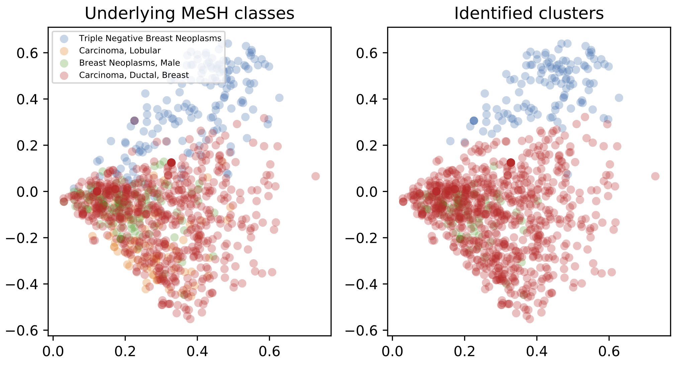

# Data preparation

Got articles for the query "**breast neoplasms[MeSH Major Topic]**" from pubmed on September 21, 2018 and saved as brca_med.xml.  

- brca_med.xml contains 224,940 articles.  

Did the same for pmc (as pmc doesn't give mesh terms) and save as brca_pmc.xml. 

- brca_pmc.xml contains 39,332 articles.

So, 39,332 / 224,940 = 17.5% of the articles have full texts.

Look at the mesh term distribution. Note that only major mesh terms are considered (--major) and mesh terms are generalized (--generalize) up to the level specified by **target_mesh** variable in xml2tsv_med.py. 

```bash
python xml2tsv_med.py --input data/brca_med.xml.gz --generalize --major --code > brca_med.txt

cut -f 4 brca_med.txt | perl -npe 's/\|/\n/g' | sort | uniq -c | sort -nr | less
  11115 Carcinoma, Ductal, Breast
   3475 Carcinoma, Lobular
   2588 Triple Negative Breast Neoplasms
   1955 Breast Neoplasms, Male
    342 Inflammatory Breast Neoplasms
    155 Hereditary Breast and Ovarian Cancer Syndrome
    100 Unilateral Breast Neoplasms
     61 Breast Carcinoma In Situ
```

Use only top 4 frequent MeSH. (Specify **classes** variables as follows in extract.py.)

> classes = {"Carcinoma, Ductal, Breast",
>            "Carcinoma, Lobular",
>            "Triple Negative Breast Neoplasms",
>            "Breast Neoplasms, Male"}

Run extract.py again.  (Later found that --major didn't make difference since there were no MeSH terms under the top four MeSH terms in the MeSH tree.  So, --major and --code may be omitted.)

```bash
python xml2tsv_med.py --input data/brca_med.xml.gz --generalize --major --code --restrict > brca_med_top4.txt
```

This results in 16,576 articles annotated with at least one of the four mesh terms.

```bash
wc -l brca_med_top4.txt 
16576 brca_med_top4.txt
```

Make sure the distribution of the classes is the same as the above but only top four terms.

```bash
cut -f 4 brca_med_top4.txt | perl -npe 's/[\|\+]/\n/g' | sort | uniq -c | sort -nr
  11115 Carcinoma, Ductal, Breast
   3475 Carcinoma, Lobular
   2588 Triple Negative Breast Neoplasms
   1955 Breast Neoplasms, Male
```

Finally create the data set with full text by adding body text extracted from plos_pmc.xml.

```bash
python xml2tsv_pmc.py > brca_pmc_top4.txt
```

Count the number of articles and look at the distribution of classes.

```bash
wc -l brca_pmc_top4.txt
1932 brca_pmc_top4.txt

cut -f 5 brca_pmc_top4.txt | perl -npe 's/\|/\n/g' | sort | uniq -c | sort -nr
    935 Carcinoma, Ductal, Breast
    824 Triple Negative Breast Neoplasms
    290 Carcinoma, Lobular
    141 Breast Neoplasms, Male
```

Some of the articles contained in the above data sets are assigned with multiple MeSH terms. For Medinfo paper, we look at only articles with which only one MeSH term assigned.

Data set size (total number of documents).

```bash
# medline
zcat brca_med_top4.txt.gz | cut -f4 | grep -v '|' |  wc -l
14075

# pmc
zcat brca_pmc_top4.txt.gz | cut -f5 | grep -v '|' |  wc -l
1682
```

Distribution of classes (MeSH terms).

```bash
# medline
zcat brca_med_top4.txt.gz | cut -f4 | grep -v '|' |  sort | uniq -c 
   1653 Breast Neoplasms, Male
   8644 Carcinoma, Ductal, Breast
   1341 Carcinoma, Lobular
   2437 Triple Negative Breast Neoplasms

# pmc
zcat brca_pmc_top4.txt.gz | cut -f5 | grep -v '|' |  sort | uniq -c 
    124 Breast Neoplasms, Male
    687 Carcinoma, Ductal, Breast
     88 Carcinoma, Lobular
    783 Triple Negative Breast Neoplasms
```

# Experiments

## Parameters

Tested the combinations of the following parameters:

- Minimal document frequencies: words with document frequency equal or smaller than df are ignored.
  - 10, 30, 50, 70, 100
- R: Parameter for VCGS.
  - 5, 6, 7, 8, 9, 10
- D: Parameter for VCGS.
  - 0.1, 0.2, 0.3, 0.4, 0.5, 0.6, 0.7, 0.8, 0.9, 1.0
- Number of components (dimensions) for SVD: 
  - 0, 4, 8, 12, 16, 20
  - When set to 0, SVD is not applied.
- Clustering algorithms: 
  - kNN or maximin
- Number of clusters for kNN: 
  - 4
- Theta for maximin:
  - 0.8, 0.9, 0.99
  
## Abstracts (larger data)

Run an evaluation script for medline data created above. Different combinations of parameters are executed. (It takes about a couple of hours to complete.)

```bash
nice python eval.py --input brca_med_top4.txt.gz --output brca_med_top4_eval_sgl.csv --single > log_sgl.txt &

# use the same number of documents in each cluster by downsampling
nice python eval.py --input brca_med_top4.txt.gz --output brca_med_top4_eval_sgl_bal.csv --single --balance > log_bal.txt &
```

The resulting file has a set of given parameters and evaluation metric values for each line in the following order:

> df,r,d,n,alg,theta,k,c,h,vd,v,ari,ami,fms,prtm,prt,sc,sct

where 

- df is the minimal document frequency
- r and d are VCGS's parameters
- n is the number of dimensions for SVD
- alg is an clustering algorithm (kmeans or maximin)
- theta is a parameter for maximin
- k is the number of clusters. This is set beforehand for kNN but is determined by the algorithm for maximin. 
- the rest are evaluation measures: c = completeness, h = homogeneity, vd = v-measure-d, v = v-measure, ari = adjusted rand index, ami = adjusted mutual information, fms = Fowlkes-Mallows index, prtm = macro-averaged purity, prt = micro-averaged purity, sc is silhouette coefficient, and sct is silhouette coefficient computed using true labels.  
- Macro-averaged purity (prtm) is the homogeneity used in Javed's JASIST paper. Note that purity is weighted by cluster size (micro-average) and Javed's homogeneity is macro-averged.

Notes:

- v-measure-d and v-measure are different in how they treat multi-label cases.  The former treats (A, M1) and (A, M2) with evenly divided importance in evaluation, and the latter treats them as independent instances in evaluation.  Since we're looking at only single-label instances here, they must be always the same.
- When df is greater than 1 (e.g., 10), VCGS is not applied, that is, terms with document frequencies greater than this parameter are all treated as keywords.  This is for investigating the effectiness of VCGS in comparison with DF-based feature selection.

Now let's look at the 10 best parameter combinations based on adjusted rand index (AMI).

```bash
less brca_med_top4_eval_sgl.csv | sort -t',' -k13 -nr | grep ",4,0" | head
1,8,0.90,8,kmeans,nan,4,0.3950,0.3927,0.3938,0.3938,0.3073,0.3925,0.6015,0.9042,0.7871,0.2557,0.1666
1,9,1.00,8,kmeans,nan,4,0.3928,0.3874,0.3901,0.3901,0.3046,0.3872,0.6018,0.8141,0.7846,0.2569,0.1647
1,8,0.80,8,kmeans,nan,4,0.3958,0.3874,0.3916,0.3916,0.3102,0.3872,0.6071,0.8120,0.7841,0.2461,0.1669
1,8,0.90,20,kmeans,nan,4,0.3969,0.3862,0.3915,0.3915,0.3129,0.3860,0.6101,0.8101,0.7835,0.1592,0.1194
1,8,0.90,16,kmeans,nan,4,0.3950,0.3847,0.3898,0.3898,0.3096,0.3845,0.6078,0.8106,0.7828,0.1773,0.1349
1,10,0.70,16,kmeans,nan,4,0.4079,0.3842,0.3957,0.3957,0.3316,0.3840,0.6285,0.8039,0.7823,0.1632,0.1236
1,8,0.80,20,kmeans,nan,4,0.4006,0.3835,0.3919,0.3919,0.3188,0.3834,0.6175,0.9051,0.7817,0.1525,0.1184
1,6,0.60,0,kmeans,nan,4,0.3870,0.3817,0.3844,0.3844,0.2932,0.3816,0.5945,0.8155,0.7827,0.0958,0.0688
1,6,0.60,16,kmeans,nan,4,0.3874,0.3797,0.3835,0.3835,0.2942,0.3795,0.5970,0.8154,0.7824,0.1751,0.1382
1,9,1.00,0,kmeans,nan,4,0.3902,0.3793,0.3847,0.3847,0.3021,0.3791,0.6038,0.8100,0.7803,0.1031,0.0710
```

Observations:

- good AMI seems to come with relatively good prt (but the opposite doesn't hold; see below).
- df = 1 dominates the top 10, which means VCGS works better than DF-based feature selection.
- kmeans worked better than maximin
- LSA generally worked.
- Good parameter settings (r, d, n) seem more or less random and may be difficult to tune.  More investigation is needed to see how sensitive the performance is to these parameters.

Let's look at prt-sorted results.

```bash
# ranking by prt
less brca_med_top4_eval_sgl.csv | sort -t',' -k16 -nr | grep ",4,0" | head
1,7,0.20,4,maximin,0.80,4,0.3623,0.3961,0.3784,0.3784,0.2990,0.3621,0.5762,0.8244,0.7982,0.4748,0.0411
1,8,0.20,4,maximin,0.80,4,0.3260,0.3755,0.3490,0.3490,0.2869,0.3258,0.5534,0.7858,0.7981,0.5080,0.0429
1,8,0.90,8,kmeans,nan,4,0.3950,0.3927,0.3938,0.3938,0.3073,0.3925,0.6015,0.9042,0.7871,0.2557,0.1666
1,10,0.40,4,kmeans,nan,4,0.3314,0.3625,0.3463,0.3463,0.2455,0.3312,0.5378,0.7988,0.7858,0.4355,0.0448
1,8,1.00,16,maximin,0.99,4,0.3336,0.3667,0.3494,0.3494,0.2646,0.3335,0.5471,0.8209,0.7857,0.1772,0.1401
1,6,0.60,8,maximin,0.99,4,0.3235,0.3709,0.3456,0.3456,0.2735,0.3233,0.5452,0.7775,0.7857,0.2839,0.1341
1,6,0.60,8,maximin,0.90,4,0.3235,0.3709,0.3456,0.3456,0.2735,0.3233,0.5452,0.7775,0.7857,0.2839,0.1341
1,9,0.40,4,kmeans,nan,4,0.3307,0.3606,0.3450,0.3450,0.2447,0.3305,0.5379,0.8001,0.7854,0.4364,0.0406
1,9,1.00,8,kmeans,nan,4,0.3928,0.3874,0.3901,0.3901,0.3046,0.3872,0.6018,0.8141,0.7846,0.2569,0.1647
1,8,0.80,8,kmeans,nan,4,0.3958,0.3874,0.3916,0.3916,0.3102,0.3872,0.6071,0.8120,0.7841,0.2461,0.1669
```

Observations:

- Purity reached nearly 0.8 but AMI is not necessarily high.
- maximin was found competitive to kmeans.
- LSA generally works

Then, let's see how good the DF-based feature selection is.  The following shows the 10 best results in AMI where minimum DF was set to other than 1.

```bash
less brca_med_top4_eval_sgl.csv | grep -vP '^1,' | grep ",4,0" | sort -t',' -k13 -nr | head
100,nan,nan,20,kmeans,nan,4,0.3676,0.3484,0.3577,0.3577,0.3374,0.3482,0.6311,0.7893,0.7613,0.1357,0.1064
70,nan,nan,0,kmeans,nan,4,0.2722,0.2835,0.2778,0.2778,0.2037,0.2720,0.5263,0.6756,0.6696,0.0227,0.0151
100,nan,nan,0,kmeans,nan,4,0.2719,0.3106,0.2899,0.2899,0.1681,0.2717,0.4832,0.7739,0.7294,0.0197,0.0168
50,nan,nan,0,kmeans,nan,4,0.2693,0.2821,0.2756,0.2756,0.1978,0.2691,0.5209,0.6231,0.6707,0.0209,0.0138
30,nan,nan,0,kmeans,nan,4,0.2688,0.3035,0.2851,0.2851,0.1652,0.2686,0.4853,0.8006,0.7285,0.0138,0.0122
10,nan,nan,0,kmeans,nan,4,0.2661,0.2988,0.2815,0.2815,0.1607,0.2659,0.4843,0.8949,0.7277,0.0108,0.0097
30,nan,nan,16,kmeans,nan,4,0.2634,0.2963,0.2789,0.2789,0.1593,0.2632,0.4828,0.7731,0.7270,0.1778,0.1172
70,nan,nan,20,kmeans,nan,4,0.2628,0.2968,0.2787,0.2787,0.1589,0.2626,0.4809,0.7105,0.7258,0.1555,0.1060
10,nan,nan,4,kmeans,nan,4,0.2623,0.2870,0.2741,0.2741,0.1811,0.2621,0.4992,0.5886,0.6770,0.4179,0.0381
10,nan,nan,20,kmeans,nan,4,0.2622,0.2721,0.2671,0.2671,0.1934,0.2620,0.5205,0.6219,0.6704,0.1646,0.1044
```

Observations:

- kmeans worked better than maximin.
- AMI is less than 0.3 except for the best result (0.3482), which indicates VCGS generally works better.  

## Full texts vs. abstracts (smaller data)

The aim of the following experiments is to show, if any, the advantage of full-text data over abstracts for clustering biomedical articles.  First, run eval.py script. (We can run them in parallel as follows. Takes less than an hour on miksa3.)

```bash
nice python eval.py --input brca_pmc_top4.txt.gz --output brca_top4_eval_all_sgl.csv --single > log_full.txt &

nice python eval.py --input brca_pmc_top4.txt.gz --output brca_top4_eval_ta_sgl.csv --fields title,abstract --single > log_ta.txt &

nice python eval.py --input brca_pmc_top4.txt.gz --output brca_top4_eval_t_sgl.csv --fields title --single > log_t.txt &
```

Sort by adjusted mutual information.

```bash
# full text
less brca_top4_eval_all_sgl.csv | grep ",4,0." | sort -t',' -k13 -nr | head
1,6,0.40,8,maximin,0.90,4,0.4015,0.4389,0.4193,0.4193,0.4637,0.4001,0.6637,0.8125,0.8036,0.3521,0.1424
1,9,0.60,16,maximin,0.99,4,0.3563,0.4013,0.3774,0.3774,0.3830,0.3548,0.6079,0.7311,0.7589,0.2206,0.1767
1,8,0.50,8,maximin,0.99,4,0.3493,0.3840,0.3658,0.3658,0.4236,0.3478,0.6405,0.7494,0.7720,0.3620,0.1490
1,8,0.50,8,maximin,0.90,4,0.3493,0.3840,0.3658,0.3658,0.4236,0.3478,0.6405,0.7494,0.7720,0.3620,0.1490
1,5,0.30,8,maximin,0.99,4,0.3469,0.3906,0.3674,0.3674,0.4166,0.3454,0.6304,0.7398,0.7780,0.3780,0.1563
1,9,0.60,8,maximin,0.99,4,0.3426,0.3779,0.3594,0.3594,0.4196,0.3411,0.6375,0.7420,0.7690,0.3640,0.1471
1,9,0.60,8,maximin,0.90,4,0.3426,0.3779,0.3594,0.3594,0.4196,0.3411,0.6375,0.7420,0.7690,0.3640,0.1471
1,8,0.70,8,maximin,0.90,4,0.3409,0.3849,0.3616,0.3616,0.4077,0.3394,0.6230,0.6933,0.7686,0.3681,0.1303
1,7,0.60,12,maximin,0.99,4,0.3387,0.4024,0.3678,0.3678,0.3742,0.3373,0.5925,0.7663,0.7673,0.2663,0.1461
1,7,0.60,12,maximin,0.90,4,0.3387,0.4024,0.3678,0.3678,0.3742,0.3373,0.5925,0.7663,0.7673,0.2663,0.1461

# title+abstract
less brca_top4_eval_ta_sgl.csv | grep ",4,0." | sort -t',' -k13 -nr | head
1,5,0.10,20,kmeans,nan,4,0.4377,0.3898,0.4123,0.4123,0.3473,0.3882,0.6198,0.8749,0.7562,0.1655,0.1334
1,5,0.20,16,kmeans,nan,4,0.3843,0.3861,0.3852,0.3852,0.2547,0.3828,0.5517,0.8414,0.7081,0.1533,0.1513
1,5,1.00,8,maximin,0.90,4,0.3814,0.4461,0.4112,0.4112,0.4227,0.3797,0.6235,0.7277,0.7663,0.5386,0.1918
1,5,0.20,20,kmeans,nan,4,0.3734,0.3843,0.3788,0.3788,0.2490,0.3719,0.5430,0.7381,0.7045,0.1382,0.1303
1,5,0.20,12,kmeans,nan,4,0.3696,0.3862,0.3777,0.3777,0.2603,0.3681,0.5456,0.7358,0.7111,0.1967,0.1790
1,5,0.80,12,kmeans,nan,4,0.3661,0.3885,0.3770,0.3770,0.2119,0.3644,0.5114,0.8162,0.6703,0.2882,0.1530
1,5,0.20,8,kmeans,nan,4,0.3632,0.3758,0.3694,0.3694,0.2523,0.3616,0.5426,0.7573,0.7063,0.2335,0.1729
1,9,1.00,20,kmeans,nan,4,0.3621,0.3794,0.3706,0.3706,0.2007,0.3606,0.5120,0.8168,0.6659,0.1635,0.1307
1,6,0.50,16,kmeans,nan,4,0.3617,0.3664,0.3641,0.3641,0.1904,0.3601,0.5159,0.9084,0.6415,0.1543,0.1434
1,7,0.60,20,kmeans,nan,4,0.3615,0.3709,0.3661,0.3661,0.1965,0.3599,0.5157,0.7376,0.6570,0.1448,0.1338

# title
less brca_top4_eval_t_sgl.csv | grep ",4,0." | sort -t',' -k13 -nr | head
1,5,0.90,20,kmeans,nan,4,0.3283,0.3233,0.3258,0.3258,0.2285,0.3216,0.5415,0.9621,0.7505,0.1742,0.0747
50,nan,nan,4,kmeans,nan,4,0.3228,0.3405,0.3314,0.3314,0.2476,0.3212,0.5402,0.7901,0.7598,0.5600,-0.0528
70,nan,nan,4,kmeans,nan,4,0.3176,0.3555,0.3355,0.3355,0.2712,0.3160,0.5421,0.6358,0.7706,0.6073,-0.0047
1,10,0.90,0,kmeans,nan,4,0.3416,0.3149,0.3277,0.3277,0.1544,0.3131,0.5210,0.8239,0.6313,0.0574,0.0278
30,nan,nan,8,kmeans,nan,4,0.3158,0.3093,0.3125,0.3125,0.2155,0.3075,0.5343,0.9492,0.7443,0.3025,0.0357
50,nan,nan,8,kmeans,nan,4,0.3088,0.3223,0.3154,0.3154,0.2212,0.3071,0.5275,0.9633,0.7483,0.3317,0.0017
50,nan,nan,0,kmeans,nan,4,0.3080,0.3669,0.3349,0.3349,0.2050,0.3066,0.4847,0.7581,0.7489,0.1757,0.0780
70,nan,nan,20,kmeans,nan,4,0.3071,0.3397,0.3225,0.3225,0.2412,0.3054,0.5272,0.6271,0.7585,0.2594,0.0652
50,nan,nan,12,kmeans,nan,4,0.3065,0.3194,0.3128,0.3128,0.2172,0.3048,0.5256,0.7987,0.7465,0.2732,0.0573
100,nan,nan,4,kmeans,nan,4,0.3048,0.3681,0.3334,0.3334,0.2669,0.3033,0.5220,0.6188,0.7685,0.6613,-0.0112
```

Observations:

- Using all fields (title+abstract+fulltext) achieved the best performance in ARI, followed by title+abs, then title.
- When using only titles, DF-based feature selection worked better than VCGS in most cases. This would be due to the small number of words from titles (therefore not many keywords were identified by VCGS).  
- maximin generally works better than kmeans for title+abstract+fulltext.
- LSA is generally effective.

Sort by prt.

```bash
less brca_top4_eval_all_sgl.csv | grep ",4,0." | sort -t',' -k16 -nr | head -5
1,6,0.40,8,maximin,0.90,4,0.4015,0.4389,0.4193,0.4193,0.4637,0.4001,0.6637,0.8125,0.8036,0.3521,0.1424
1,5,0.30,8,maximin,0.99,4,0.3469,0.3906,0.3674,0.3674,0.4166,0.3454,0.6304,0.7398,0.7780,0.3780,0.1563
1,8,0.50,8,maximin,0.99,4,0.3493,0.3840,0.3658,0.3658,0.4236,0.3478,0.6405,0.7494,0.7720,0.3620,0.1490
1,8,0.50,8,maximin,0.90,4,0.3493,0.3840,0.3658,0.3658,0.4236,0.3478,0.6405,0.7494,0.7720,0.3620,0.1490
1,5,0.30,12,maximin,0.99,4,0.3027,0.3466,0.3232,0.3232,0.3900,0.3012,0.6115,0.7657,0.7720,0.2777,0.1946

less brca_top4_eval_ta_sgl.csv | grep ",4,0." | sort -t',' -k16 -nr | head -5
1,5,1.00,8,maximin,0.90,4,0.3814,0.4461,0.4112,0.4112,0.4227,0.3797,0.6235,0.7277,0.7663,0.5386,0.1918
1,5,0.10,20,kmeans,nan,4,0.4377,0.3898,0.4123,0.4123,0.3473,0.3882,0.6198,0.8749,0.7562,0.1655,0.1334
30,nan,nan,12,kmeans,nan,4,0.3496,0.3078,0.3274,0.3274,0.3088,0.3060,0.5974,0.8093,0.7283,0.2708,0.1825
1,5,0.40,8,maximin,0.80,4,0.2670,0.3336,0.2966,0.2966,0.3451,0.2655,0.5649,0.7309,0.7160,0.3126,0.1103
1,5,0.20,12,kmeans,nan,4,0.3696,0.3862,0.3777,0.3777,0.2603,0.3681,0.5456,0.7358,0.7111,0.1967,0.1790

less brca_top4_eval_t_sgl.csv | grep ",4,0." | sort -t',' -k16 -nr | head -5
70,nan,nan,4,kmeans,nan,4,0.3176,0.3555,0.3355,0.3355,0.2712,0.3160,0.5421,0.6358,0.7706,0.6073,-0.0047
100,nan,nan,4,kmeans,nan,4,0.3048,0.3681,0.3334,0.3334,0.2669,0.3033,0.5220,0.6188,0.7685,0.6613,-0.0112
100,nan,nan,0,kmeans,nan,4,0.2920,0.3545,0.3202,0.3202,0.2644,0.2905,0.5188,0.7703,0.7661,0.4266,0.0320
50,nan,nan,4,kmeans,nan,4,0.3228,0.3405,0.3314,0.3314,0.2476,0.3212,0.5402,0.7901,0.7598,0.5600,-0.0528
100,nan,nan,8,kmeans,nan,4,0.2923,0.3511,0.3190,0.3190,0.2457,0.2907,0.5096,0.8119,0.7587,0.4660,-0.0045
```

Observations:

- Purity is similar but other metics are quite different.

## Additional experiment on BIOSIS data

Data creation for this experiment is described [here](biosis/README.md).

```bash
nice python eval.py --input biosis.txt --output biosis_eval_sgl.csv --single > log_biosis.txt &
```

Sort the results by AMI.

```bash
less biosis_eval_sgl.csv | sort -t',' -k13 -nr | grep ",4,0" | head
1,6,0.30,0,kmeans,nan,4,0.4931,0.4374,0.4636,0.4636,0.5056,0.4361,0.7583,0.9127,0.8309,0.0383,0.0176
10,nan,nan,20,kmeans,nan,4,0.4813,0.4255,0.4517,0.4517,0.4979,0.4243,0.7548,0.9113,0.8285,0.1387,0.0539
1,10,0.10,20,kmeans,nan,4,0.4926,0.4244,0.4560,0.4560,0.5083,0.4232,0.7632,0.7740,0.8293,0.1324,0.0598
1,10,0.10,0,kmeans,nan,4,0.4189,0.4638,0.4402,0.4402,0.4740,0.4177,0.7102,0.7514,0.8352,0.0192,0.0088
1,7,0.40,0,kmeans,nan,4,0.3958,0.4526,0.4223,0.4223,0.4179,0.3947,0.6724,0.7877,0.8375,0.0419,0.0190
1,10,0.40,0,kmeans,nan,4,0.3935,0.4628,0.4254,0.4254,0.4202,0.3924,0.6679,0.8592,0.8327,0.0370,0.0168
1,5,0.40,0,kmeans,nan,4,0.3927,0.4591,0.4233,0.4233,0.4030,0.3915,0.6592,0.8787,0.8379,0.0519,0.0236
1,7,1.00,0,kmeans,nan,4,0.3893,0.4328,0.4099,0.4099,0.3998,0.3881,0.6677,0.7960,0.8290,0.0799,0.0361
1,8,0.40,0,kmeans,nan,4,0.3872,0.4436,0.4135,0.4135,0.4095,0.3861,0.6673,0.7835,0.8343,0.0404,0.0183
1,5,0.50,0,kmeans,nan,4,0.3852,0.4512,0.4156,0.4156,0.4007,0.3840,0.6578,0.7830,0.8355,0.0596,0.0273
```

## Plotting MeSH classes and identified clusters

From the results above, we can identify the best parameter settings and provide them to visual_library.py to plot MeSH classes and identified clusters.  Note that color assignment will change every time, so the resulting plot may look different (but cluster assignemnts won't change; only colors).

```bash
python visual_library.py -i brca_med_top4.txt.gz --clustering kmeans --svd 8 --single -r 8 -d 0.9 -k 4 --visualize
```




