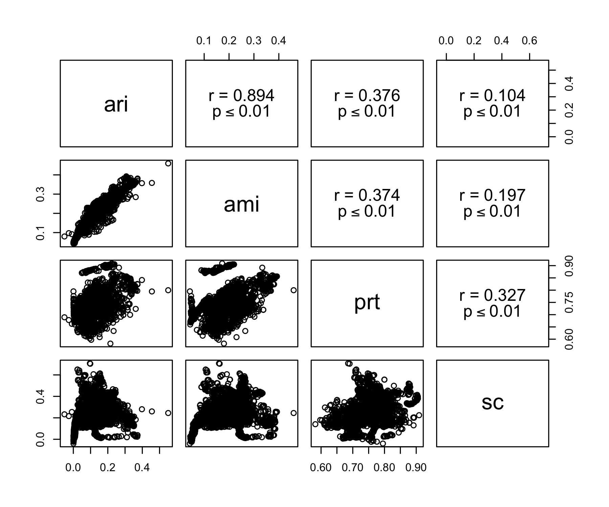

# Data

Data set size (total number of documents).

```bash
# medline
zcat brca_med_top4.txt.gz | cut -f4 | grep -v '|' |  wc -l
14075

# pmc
zcat brca_pmc_top4.txt.gz | cut -f5 | grep -v '|' |  wc -l
1682
```

Distribution of classes (MeSH terms).

```bash
# medline
zcat brca_med_top4.txt.gz | cut -f4 | grep -v '|' |  sort | uniq -c 
   1653 Breast Neoplasms, Male
   8644 Carcinoma, Ductal, Breast
   1341 Carcinoma, Lobular
   2437 Triple Negative Breast Neoplasms

# pmc
zcat brca_pmc_top4.txt.gz | cut -f5 | grep -v '|' |  sort | uniq -c 
    124 Breast Neoplasms, Male
    687 Carcinoma, Ductal, Breast
     88 Carcinoma, Lobular
    783 Triple Negative Breast Neoplasms
```

# Experiments

## Parameters

Tested the combinations of the following parameters:

- Minimal document frequencies: words with document frequency equal or smaller than df are ignored.
  - 10, 30, 50, 70, 100
- R: Parameter for VCGS.
  - 5, 6, 7, 8, 9, 10
- D: Parameter for VCGS.
  - 0.05, 0.10, 0.15, 0.20, 0.25, 0.30, 0.35, 0.40, 0.45, 0.55, 0.6, 0.65, 0.7, 0.75, 0.8, 0.85, 0.9, 0.95, 1.0
- Number of components (dimensions) for SVD: 
  - 0, 4, 8, 12, 16, 20
  - When set to 0, SVD is not applied.
- Clustering algorithms: 
  - kNN or maximin
- Number of clusters for kNN: 
  - 4
- Theta for maximin:
  - 0.8, 0.9, 0.99
  
## Abstracts (larger data)

Run an evaluation script for medline data created above. Different combinations of parameters are executed. (It takes about a couple of hours to complete.)

```bash
nice python eval.py --input brca_med_top4.txt.gz --output brca_med_top4_eval_sgl.csv --single -d  "0.05,0.1,0.15,0.2,0.25,0.3,0.35,0.4,0.45,0.5,0.55,0.6,0.65,0.7,0.75,0.8,0.85,0.9,0.95,1.0" > log_sgl.txt &

# use the same number of documents in each cluster by downsampling
nice python eval.py --input brca_med_top4.txt.gz --output brca_med_top4_eval_sgl_bal.csv --single --balance -d  "0.05,0.1,0.15,0.2,0.25,0.3,0.35,0.4,0.45,0.5,0.55,0.6,0.65,0.7,0.75,0.8,0.85,0.9,0.95,1.0" > log_bal.txt &
```

The resulting file has a set of given parameters and evaluation metric values for each line in the following order:

> df,r,d,n,alg,k,c,h,vd,v,ari,ami,fms,prt,sc,sct

where 

- df is the minimal document frequency
- r and d are VCGS's parameters
- n is the number of dimensions for SVD
- alg is an clustering algorithm (kmeans or maximin)
- k is the number of clusters. This is set beforehand for kNN but is determined by the algorithm for maximin. 
- the rest are evaluation measures: c = completeness, h = homogeneity, vd = v-measure-d, v = v-measure, ari = adjusted rand index, ami = adjusted mutual information, fms = Fowlkes-Mallows index, prt = macro-averaged purity, sc is silhouette coefficient, and sct is silhouette coefficient computed using true labels.  
- Macro-averaged purity (prt) is the homogeneity used in Javed's JASIST paper. Note that purity is weighted by cluster size (micro-average) and Javed's homogeneity is macro-averged.

Notes:

- v-measure-d and v-measure are different in how they treat multi-label cases.  The former treats (A, M1) and (A, M2) with evenly divided importance in evaluation, and the latter treats them as independent instances in evaluation.  Since we're looking at only single-label instances here, they must be always the same.
- When df is greater than 1 (e.g., 10), VCGS is not applied, that is, terms with document frequencies greater than this parameter are all treated as keywords.  This is for investigating the effectiness of VCGS in comparison with DF-based feature selection.

Now let's look at the 10 best parameter combinations based on adjusted rand index (ARI).

```bash
# ranking by ari 
less brca_med_top4_eval_sgl.csv | sort -t',' -k11 -nr | head
1,10,0.85,8,maximin,4,0.4746,0.4598,0.4671,0.4671,0.5502,0.4596,0.7466,0.7997,0.2447,0.1687
1,6,0.25,0,kmeans,4,0.4203,0.3812,0.3998,0.3998,0.3726,0.3810,0.6608,0.8236,0.0387,0.0311
1,5,0.20,0,kmeans,4,0.4236,0.3772,0.3990,0.3990,0.3713,0.3770,0.6636,0.8252,0.0373,0.0304
1,9,0.15,0,kmeans,4,0.3973,0.3685,0.3824,0.3824,0.3709,0.3683,0.6556,0.7971,0.0238,0.0186
1,8,0.20,0,kmeans,4,0.3950,0.3634,0.3786,0.3786,0.3626,0.3632,0.6524,0.7989,0.0293,0.0232
1,10,0.30,0,kmeans,4,0.3940,0.3647,0.3788,0.3788,0.3613,0.3645,0.6502,0.7992,0.0329,0.0259
1,5,0.10,0,kmeans,4,0.3959,0.3597,0.3769,0.3769,0.3612,0.3595,0.6544,0.8026,0.0253,0.0202
1,6,0.15,0,kmeans,4,0.4016,0.3575,0.3783,0.3783,0.3592,0.3573,0.6569,0.8099,0.0281,0.0230
1,8,0.30,0,kmeans,4,0.4035,0.3642,0.3828,0.3828,0.3586,0.3640,0.6537,0.8155,0.0363,0.0291
1,7,0.30,0,kmeans,4,0.4043,0.3662,0.3843,0.3843,0.3581,0.3660,0.6526,0.8177,0.0395,0.0317
```

Observations:

- good ami seems to come with good prec (but the opposite doesn't hold; see below).
- df = 1 dominates the top 10, which means VCGS is better than DF-based feature selection.
- kmeans works better than maximin.
- Good r and d values seem more or less random and may be difficult to find optimum settings.  More investigation is needed to see how sensitive the performance is to these parameters.
- SVD gives no advantage.

Let's look at prt-sorted results.

```bash
# ranking by prec
less brca_med_top4_eval_sgl.csv | sort -t',' -k14 -nr | grep ",4,0." | head
1,5,0.35,16,kmeans,4,0.4071,0.3337,0.3668,0.3668,0.2646,0.3335,0.6237,0.8917,0.1299,0.1275
1,9,0.15,16,kmeans,4,0.3395,0.3468,0.3431,0.3431,0.2323,0.3394,0.5476,0.8681,0.1827,0.1212
1,6,0.15,20,kmeans,4,0.3362,0.3377,0.3369,0.3369,0.2242,0.3360,0.5471,0.8667,0.1570,0.1082
1,10,0.20,12,kmeans,4,0.3357,0.3452,0.3404,0.3404,0.2327,0.3355,0.5457,0.8650,0.2227,0.1402
1,6,0.55,8,kmeans,4,0.3661,0.3479,0.3568,0.3568,0.2698,0.3477,0.5918,0.8643,0.2637,0.1277
1,5,0.35,8,kmeans,4,0.3498,0.3290,0.3391,0.3391,0.2473,0.3288,0.5809,0.8627,0.2541,0.1402
1,7,0.40,16,kmeans,4,0.3359,0.3265,0.3311,0.3311,0.2272,0.3263,0.5589,0.8623,0.1768,0.1212
1,5,0.20,16,kmeans,4,0.3291,0.3227,0.3259,0.3259,0.2192,0.3225,0.5507,0.8614,0.1767,0.1215
1,6,0.60,12,kmeans,4,0.3793,0.3745,0.3769,0.3769,0.2803,0.3743,0.5871,0.8604,0.1997,0.1417
1,5,0.50,8,kmeans,4,0.3712,0.3449,0.3576,0.3576,0.2851,0.3447,0.6059,0.8594,0.2663,0.1216
```

Then, let's see how good the DF-based feature selection is.  The following shows the 10 best results in ari where minimum DF was set to other than 1.

```bash
less brca_med_top4_eval_sgl.csv | grep -vP '^1,' | sort -t',' -k11 -nr | head
100,na,na,20,kmeans,4,0.3676,0.3484,0.3577,0.3577,0.3374,0.3482,0.6311,0.7863,0.1357,0.1064
50,na,na,12,maximin,5,0.3365,0.3961,0.3639,0.3639,0.3117,0.3363,0.5772,0.8043,0.2150,0.1339
70,na,na,12,maximin,5,0.3328,0.3930,0.3604,0.3604,0.3018,0.3325,0.5700,0.8023,0.2162,0.1352
50,na,na,12,maximin,6,0.2973,0.3901,0.3374,0.3374,0.2952,0.2970,0.5553,0.7660,0.2214,0.1339
70,na,na,12,maximin,6,0.2916,0.3847,0.3317,0.3317,0.2850,0.2913,0.5473,0.7637,0.2221,0.1352
30,na,na,12,maximin,7,0.2614,0.3799,0.3097,0.3097,0.2607,0.2611,0.5197,0.7567,0.2398,0.1338
100,na,na,12,maximin,5,0.2561,0.3325,0.2893,0.2893,0.2337,0.2559,0.5045,0.7379,0.2255,0.1362
10,na,na,8,maximin,7,0.2614,0.4349,0.3265,0.3265,0.2244,0.2611,0.4634,0.8033,0.3965,0.1586
10,na,na,8,maximin,4,0.2455,0.2706,0.2574,0.2574,0.2113,0.2453,0.5160,0.6729,0.2633,0.1586
10,na,na,8,maximin,4,0.2455,0.2706,0.2574,0.2574,0.2113,0.2453,0.5160,0.6729,0.2633,0.1586
```

Their ari was found to be around 0.2 (except for 0.3374), which is pretty low.  So VCGS does work!  

How about v-measure or ami?

```bash
# v-measure
less brca_med_top4_eval_sgl.csv | sort -t',' -k10 -nr | grep ',4,0' | head -5
1,10,0.85,8,maximin,4,0.4746,0.4598,0.4671,0.4671,0.5502,0.4596,0.7466,0.7997,0.2447,0.1687
1,6,0.25,0,kmeans,4,0.4203,0.3812,0.3998,0.3998,0.3726,0.3810,0.6608,0.8236,0.0387,0.0311
1,5,0.20,0,kmeans,4,0.4236,0.3772,0.3990,0.3990,0.3713,0.3770,0.6636,0.8252,0.0373,0.0304
1,10,0.70,16,kmeans,4,0.4079,0.3842,0.3957,0.3957,0.3316,0.3840,0.6285,0.8473,0.1632,0.1236
1,8,0.90,8,kmeans,4,0.3950,0.3927,0.3938,0.3938,0.3073,0.3925,0.6015,0.8561,0.2557,0.1666

# ami
less brca_med_top4_eval_sgl.csv | sort -t',' -k12 -nr | grep ',4,0' | head -5
1,10,0.85,8,maximin,4,0.4746,0.4598,0.4671,0.4671,0.5502,0.4596,0.7466,0.7997,0.2447,0.1687
1,8,0.90,8,kmeans,4,0.3950,0.3927,0.3938,0.3938,0.3073,0.3925,0.6015,0.8561,0.2557,0.1666
1,8,0.85,8,kmeans,4,0.3947,0.3892,0.3919,0.3919,0.3086,0.3890,0.6044,0.8554,0.2477,0.1693
1,9,1.00,8,kmeans,4,0.3928,0.3874,0.3901,0.3901,0.3046,0.3872,0.6018,0.8553,0.2569,0.1647
1,8,0.80,8,kmeans,4,0.3958,0.3874,0.3916,0.3916,0.3102,0.3872,0.6071,0.8539,0.2461,0.1669
```

Observations:

- Overall, we see similar patterns to ari.
  - df = 1 still works better (VCGS is better).
  - kmeans still works better.
- LSA is sometimes effective.
- Two results (ranking) are quite similar.

## Full texts vs. abstracts (smaller data)

The aim of the following experiments is to show, if any, the advantage of full-text data over abstracts for clustering biomedical articles.  First, run eval.py script. (We can run them in parallel as follows. Takes less than an hour on miksa3.)

```bash
nice python eval.py --input brca_pmc_top4.txt.gz --output brca_top4_eval_all_sgl.csv --single -d  "0.05,0.1,0.15,0.2,0.25,0.3,0.35,0.4,0.45,0.5,0.55,0.6,0.65,0.7,0.75,0.8,0.85,0.9,0.95,1.0" > log_full.txt &

nice python eval.py --input brca_pmc_top4.txt.gz --output brca_top4_eval_ta_sgl.csv --fields title,abstract --single -d  "0.05,0.1,0.15,0.2,0.25,0.3,0.35,0.4,0.45,0.5,0.55,0.6,0.65,0.7,0.75,0.8,0.85,0.9,0.95,1.0" > log_ta.txt &

nice python eval.py --input brca_pmc_top4.txt.gz --output brca_top4_eval_t_sgl.csv --fields title --single -d "0.05,0.1,0.15,0.2,0.25,0.3,0.35,0.4,0.45,0.5,0.55,0.6,0.65,0.7,0.75,0.8,0.85,0.9,0.95,1.0" > log_t.txt &
```

Let's look at the result based on ARI.

```bash
# Evaluation for title+abstract+fulltext
less brca_top4_eval_all_sgl.csv | grep ",4,0." | sort -t',' -k11 -nr | head
1,6,0.25,8,maximin,4,0.3534,0.3799,0.3662,0.3662,0.4287,0.3519,0.6425,0.7203,0.3689,0.1414
1,5,0.50,12,maximin,4,0.4062,0.4082,0.4072,0.4072,0.4254,0.4047,0.6508,0.7602,0.2658,0.1499
1,6,0.40,12,maximin,4,0.3487,0.3508,0.3498,0.3498,0.4162,0.3470,0.6437,0.6901,0.2638,0.1828
1,8,1.00,8,maximin,4,0.3792,0.4209,0.3990,0.3990,0.4138,0.3778,0.6296,0.7743,0.3807,0.1459
1,9,0.75,12,maximin,4,0.4198,0.3985,0.4089,0.4089,0.4132,0.3970,0.6519,0.7673,0.2563,0.1536
1,8,0.50,8,maximin,4,0.3411,0.3705,0.3552,0.3552,0.4078,0.3396,0.6286,0.6909,0.3188,0.1490
1,6,0.10,20,kmeans,4,0.3802,0.2989,0.3347,0.3347,0.4028,0.2971,0.6597,0.6873,0.2159,0.1480
1,6,0.10,8,kmeans,4,0.3855,0.3096,0.3434,0.3434,0.3999,0.3078,0.6559,0.6979,0.4356,0.2603
1,8,0.10,4,kmeans,4,0.3233,0.3084,0.3157,0.3157,0.3880,0.3066,0.6323,0.7161,0.5714,0.2239
1,8,0.70,12,maximin,4,0.3481,0.3512,0.3496,0.3496,0.3863,0.3464,0.6245,0.7084,0.2588,0.1508

# Evaluation for title+abstract.
less brca_top4_eval_ta_sgl.csv | grep ",4,0." | sort -t',' -k11 -nr | head 
1,5,1.00,12,maximin,4,0.4035,0.3888,0.3960,0.3960,0.3623,0.3868,0.6136,0.7043,0.4033,0.2883
1,5,0.70,12,maximin,4,0.3430,0.4051,0.3715,0.3715,0.3517,0.3415,0.5773,0.7252,0.2641,0.1516
1,5,0.95,8,maximin,4,0.2766,0.3159,0.2949,0.2949,0.3501,0.2746,0.5806,0.6927,0.4515,0.1908
1,5,0.95,8,maximin,4,0.2766,0.3159,0.2949,0.2949,0.3501,0.2746,0.5806,0.6927,0.4515,0.1908
1,5,0.90,8,maximin,4,0.2766,0.3159,0.2949,0.2949,0.3501,0.2746,0.5806,0.6927,0.4515,0.1908
1,5,0.90,8,maximin,4,0.2766,0.3159,0.2949,0.2949,0.3501,0.2746,0.5806,0.6927,0.4515,0.1908
1,5,0.10,20,kmeans,4,0.4377,0.3898,0.4123,0.4123,0.3473,0.3882,0.6198,0.8749,0.1655,0.1334
1,5,1.00,8,maximin,4,0.2686,0.3144,0.2897,0.2897,0.3339,0.2666,0.5647,0.6128,0.4077,0.1918
1,5,0.95,12,maximin,4,0.2588,0.2872,0.2723,0.2723,0.3330,0.2567,0.5776,0.6454,0.3204,0.2602
1,5,0.90,12,maximin,4,0.2588,0.2872,0.2723,0.2723,0.3330,0.2567,0.5776,0.6454,0.3204,0.2602

# Evaluation for title.
less brca_top4_eval_t_sgl.csv | grep ",4,0." | sort -t',' -k11 -nr | head
70,nan,nan,4,kmeans,4,0.3176,0.3555,0.3355,0.3355,0.2712,0.3160,0.5421,0.8011,0.6073,-0.0047
100,nan,nan,4,kmeans,4,0.3048,0.3681,0.3334,0.3334,0.2669,0.3033,0.5220,0.7994,0.6613,-0.0112
100,nan,nan,0,kmeans,4,0.2920,0.3545,0.3202,0.3202,0.2644,0.2905,0.5188,0.7929,0.4266,0.0320
50,nan,nan,4,kmeans,4,0.3228,0.3405,0.3314,0.3314,0.2476,0.3212,0.5402,0.8001,0.5600,-0.0528
100,nan,nan,8,kmeans,4,0.2923,0.3511,0.3190,0.3190,0.2457,0.2907,0.5096,0.7957,0.4660,-0.0045
70,nan,nan,20,kmeans,4,0.3071,0.3397,0.3225,0.3225,0.2412,0.3054,0.5272,0.7998,0.2594,0.0652
70,nan,nan,8,kmeans,4,0.2977,0.3293,0.3127,0.3127,0.2317,0.2961,0.5212,0.7960,0.3775,0.0077
1,6,0.35,4,maximin,4,0.2070,0.2430,0.2236,0.2236,0.2290,0.2053,0.5003,0.6789,0.6228,0.0607
1,6,0.35,4,maximin,4,0.2070,0.2430,0.2236,0.2236,0.2290,0.2053,0.5003,0.6789,0.6228,0.0607
1,6,0.30,4,maximin,4,0.2070,0.2430,0.2236,0.2236,0.2290,0.2053,0.5003,0.6789,0.6228,0.0607
```

Observations:

- Using all fields (title+abstract+fulltext) achieved the best performance in ARI, followed by title+abs, then title.
- When using only titles, DF-based feature selection worked better than VCGS in most cases. This would be due to the small number of words from titles (therefore not many keywords were identified by VCGS).  This tendency is also seen in title+abstract.
- kmeans generally works better than maximin.
- LSA is often found effective maybe due to the smaller size of data?

Sort by prt.

```bash
less brca_top4_eval_all_sgl.csv | grep ",4,0." | sort -t',' -k14 -nr | head -5
1,10,0.85,20,kmeans,4,0.2518,0.2502,0.2510,0.2510,0.0894,0.2483,0.4642,0.8321,0.1441,0.1549
1,10,0.85,12,kmeans,4,0.2561,0.2590,0.2575,0.2575,0.1023,0.2542,0.4660,0.8321,0.1844,0.1433
1,10,0.95,16,kmeans,4,0.2544,0.2571,0.2557,0.2557,0.0956,0.2525,0.4625,0.8318,0.1615,0.1244
1,10,0.90,16,kmeans,4,0.2544,0.2571,0.2557,0.2557,0.0956,0.2525,0.4625,0.8318,0.1615,0.1244
1,10,0.95,20,kmeans,4,0.2497,0.2466,0.2481,0.2481,0.0800,0.2446,0.4611,0.8317,0.1435,0.1553

less brca_top4_eval_ta_sgl.csv | grep ",4,0." | sort -t',' -k14 -nr | head -5
1,5,0.10,20,kmeans,4,0.4377,0.3898,0.4123,0.4123,0.3473,0.3882,0.6198,0.8749,0.1655,0.1334
1,7,0.55,8,kmeans,4,0.3600,0.3647,0.3623,0.3623,0.1880,0.3584,0.5139,0.8128,0.2214,0.1257
1,9,1.00,20,kmeans,4,0.3621,0.3794,0.3706,0.3706,0.2007,0.3606,0.5120,0.8121,0.1635,0.1307
1,6,0.65,8,kmeans,4,0.3466,0.3437,0.3452,0.3452,0.1731,0.3420,0.5110,0.8110,0.2259,0.0876
1,6,0.60,8,kmeans,4,0.3466,0.3437,0.3452,0.3452,0.1731,0.3420,0.5110,0.8110,0.2259,0.0876

less brca_top4_eval_t_sgl.csv | grep ",4,0." | sort -t',' -k14 -nr | head -5
50,nan,nan,0,kmeans,4,0.3080,0.3669,0.3349,0.3349,0.2050,0.3066,0.4847,0.8194,0.1757,0.0780
1,5,1.00,0,kmeans,4,0.3023,0.3511,0.3249,0.3249,0.1870,0.3008,0.4802,0.8165,0.1239,0.0579
1,5,0.95,0,kmeans,4,0.2952,0.3402,0.3161,0.3161,0.1692,0.2936,0.4715,0.8149,0.1153,0.0536
1,5,0.90,0,kmeans,4,0.2952,0.3402,0.3161,0.3161,0.1692,0.2936,0.4715,0.8149,0.1153,0.0536
1,6,1.00,20,kmeans,4,0.2905,0.3342,0.3108,0.3108,0.1598,0.2889,0.4667,0.8128,0.1968,0.0756
```

Sort by adjusted mutual information.

```bash
less brca_top4_eval_all_sgl.csv | grep ",4,0." | sort -t',' -k12 -nr | head -5
1,5,0.50,12,maximin,4,0.4062,0.4082,0.4072,0.4072,0.4254,0.4047,0.6508,0.7602,0.2658,0.1499
1,9,0.75,12,maximin,4,0.4198,0.3985,0.4089,0.4089,0.4132,0.3970,0.6519,0.7673,0.2563,0.1536
1,6,0.55,8,maximin,4,0.3895,0.4387,0.4126,0.4126,0.3714,0.3881,0.6026,0.7987,0.3736,0.1349
1,8,1.00,8,maximin,4,0.3792,0.4209,0.3990,0.3990,0.4138,0.3778,0.6296,0.7743,0.3807,0.1459
1,8,0.95,8,maximin,4,0.3694,0.4359,0.3999,0.3999,0.3732,0.3681,0.5957,0.7644,0.3698,0.1530

less brca_top4_eval_ta_sgl.csv | grep ",4,0." | sort -t',' -k12 -nr | head -5
1,5,0.10,20,kmeans,4,0.4377,0.3898,0.4123,0.4123,0.3473,0.3882,0.6198,0.8749,0.1655,0.1334
1,5,1.00,12,maximin,4,0.4035,0.3888,0.3960,0.3960,0.3623,0.3868,0.6136,0.7043,0.4033,0.2883
1,5,0.20,16,kmeans,4,0.3843,0.3861,0.3852,0.3852,0.2547,0.3828,0.5517,0.8064,0.1533,0.1513
1,5,0.20,20,kmeans,4,0.3734,0.3843,0.3788,0.3788,0.2490,0.3719,0.5430,0.8036,0.1382,0.1303
1,5,0.20,12,kmeans,4,0.3696,0.3862,0.3777,0.3777,0.2603,0.3681,0.5456,0.8019,0.1967,0.1790

less brca_top4_eval_t_sgl.csv | grep ",4,0." | sort -t',' -k12 -nr | head -5
1,5,0.95,20,kmeans,4,0.3283,0.3233,0.3258,0.3258,0.2285,0.3216,0.5415,0.8061,0.1742,0.0747
1,5,0.90,20,kmeans,4,0.3283,0.3233,0.3258,0.3258,0.2285,0.3216,0.5415,0.8061,0.1742,0.0747
50,nan,nan,4,kmeans,4,0.3228,0.3405,0.3314,0.3314,0.2476,0.3212,0.5402,0.8001,0.5600,-0.0528
70,nan,nan,4,kmeans,4,0.3176,0.3555,0.3355,0.3355,0.2712,0.3160,0.5421,0.8011,0.6073,-0.0047
1,10,0.95,0,kmeans,4,0.3416,0.3149,0.3277,0.3277,0.1544,0.3131,0.5210,0.8105,0.0574,0.0278
```

Observations:

- For both metrics, the tendency changed (abstract > fulltext > title).

# Evaluation metrics

To see the difference among different evaluation metrics empirically, the following shows Pearson's correlation coefficient between every pair of metrics **by R**, not python.

```R
cls <- c(r="numeric",d="numeric",n="numeric",k="numeric",c="numeric",h="numeric",ari="numeric", ami="numeric", vd="numeric",v="numeric",fms="numeric",prt="numeric",sc="numeric",sct="numeric") 

# abstract data 
x = read.csv("brca_med_top4_eval_sgl.csv",header=TRUE,colClasses=cls,na.strings="na") 
cor(x[,10:16],use="pairwise.complete.obs")
            v       ari       ami       fms        prt         sc        sct
v   1.0000000 0.8773201 0.9479307 0.7017890  0.4593293  0.2370127  0.3854788
ari 0.8773201 1.0000000 0.8936266 0.8188384  0.3759744  0.1035182  0.2907318
ami 0.9479307 0.8936266 1.0000000 0.8248086  0.3737182  0.1974180  0.2954746
fms 0.7017890 0.8188384 0.8248086 1.0000000  0.4131840  0.2430231  0.1334362
prt 0.4593293 0.3759744 0.3737182 0.4131840  1.0000000  0.3266357 -0.1264683
sc  0.2370127 0.1035182 0.1974180 0.2430231  0.3266357  1.0000000 -0.2043118
sct 0.3854788 0.2907318 0.2954746 0.1334362 -0.1264683 -0.2043118  1.0000000

ami and vd (or v) are found to be strongly correlated.  ari has relatively strong correlation with the three but it's not as strong as theirs.  The following shows the scatter plot for every pair of metrics: v, ari, ami, prt, sc, sct.

```R
panel.cor <- function(x, y, digits = 3, cex.cor, ...)
{
 usr <- par("usr"); on.exit(par(usr))
 par(usr = c(0, 1, 0, 1))
 # correlation coefficient
 r <- cor(x, y)
 txt <- format(c(r, 0.123456789), digits = digits)[1]
 txt <- paste("r = ", txt, sep = "")
 text(0.5, 0.6, txt, cex=1.5)

 # p-value calculation
 p <- cor.test(x, y)$p.value
 txt2 <- format(c(p, 0.123456789), digits = digits)[1]
 txt2 <- paste("p = ", txt2, sep = "")
 if(p<0.01) txt2 <- expression(paste(p <= 0.01, sep = ""))
 text(0.5, 0.4, txt2, cex=1.5)
}
quartz("",6,5) # this is for Mac
par(mar=c(5,4,1,1))
pairs(x[,c(11,12,14,15)], upper.panel = panel.cor)
```



How do r and d affect cluster quality? Note that P is used to refer to d below.

```R
cls <- c(r="numeric", d="numeric", n="numeric", ari="numeric", ami="numeric", vd="numeric",v="numeric",fms="numeric") 
x = read.csv("brca_med_top4_eval_sgl.csv",header=TRUE,colClasses=cls,na.strings="na")
x[x$df == 1 & x$alg == "kmeans" & x$n > 0 & x$k == 4, c(2,3,4,11)] -> y
colnames(y) = c("R", "P", "n", "ARI")

library(ggplot2)
library(magrittr) # for pipe operator
library(dplyr)    # for grouping

# compute mean by group
ag <- y %>% 
        group_by(R, P) %>% 
        summarise(ARI = mean(ARI))

# plot
quartz("",6,5) # this is for Mac
par(mar=c(5,4,1,1))
sp = ggplot(data=ag, mapping=aes(x=factor(R), y=factor(P), color=ARI)) + geom_point(alpha=.9, size=ag$ARI*30)
sp+scale_color_gradient(low="white", high="red") + theme_bw() + theme(panel.grid=element_blank()) + labs(x=expression(italic(R)),y=expression(italic(P)))
```


How about n (number of dimensions)?

```R
cls <- c(r="numeric", d="numeric", n="numeric", ari="numeric", ami="numeric", vd="numeric",v="numeric",fms="numeric") 
x = read.csv("brca_med_top4_eval_sgl.csv",header=TRUE,colClasses=cls,na.strings="na")
x[x$df == 1 & x$alg == "kmeans" & x$n > 0 & x$k == 4, c(2,3,4,11)] -> y
colnames(y) = c("R", "P", "n", "ARI")

quartz("",6,5) # this is for Mac
par(mar=c(5,4,1,1))

sp2 = ggplot(data=y, mapping=aes(x=factor(n), y=ARI)) + geom_boxplot()
sp2 + geom_jitter(alpha=.5, color="tomato", height=0) + theme_bw() + theme(panel.grid=element_blank()) + labs(x=expression(paste("Number of dimensions ", italic(n))))
```


