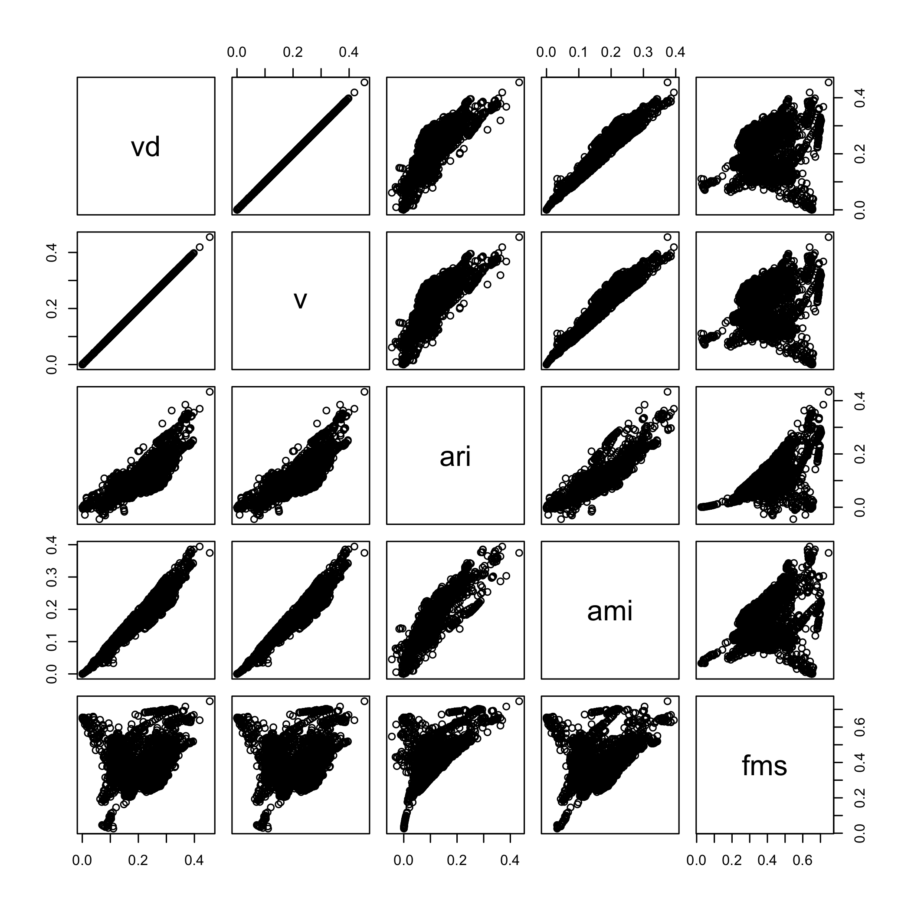
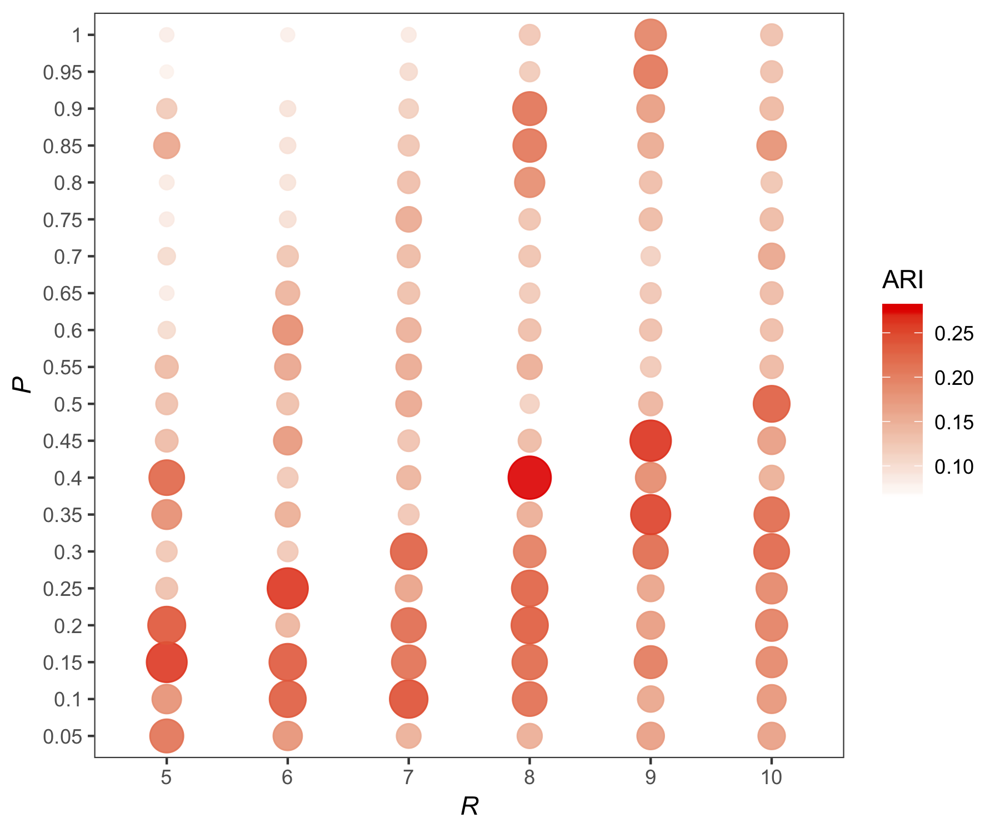
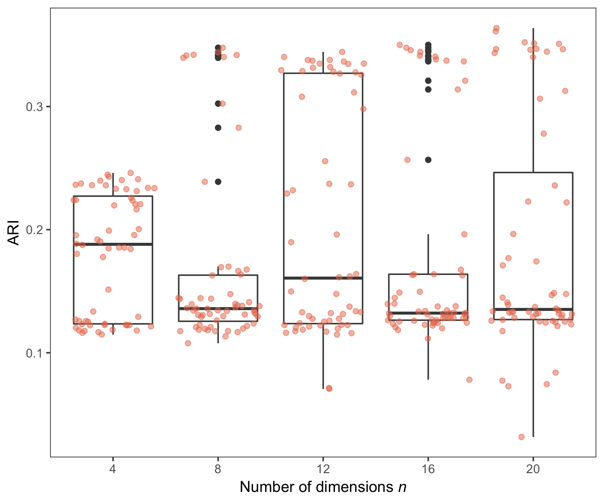
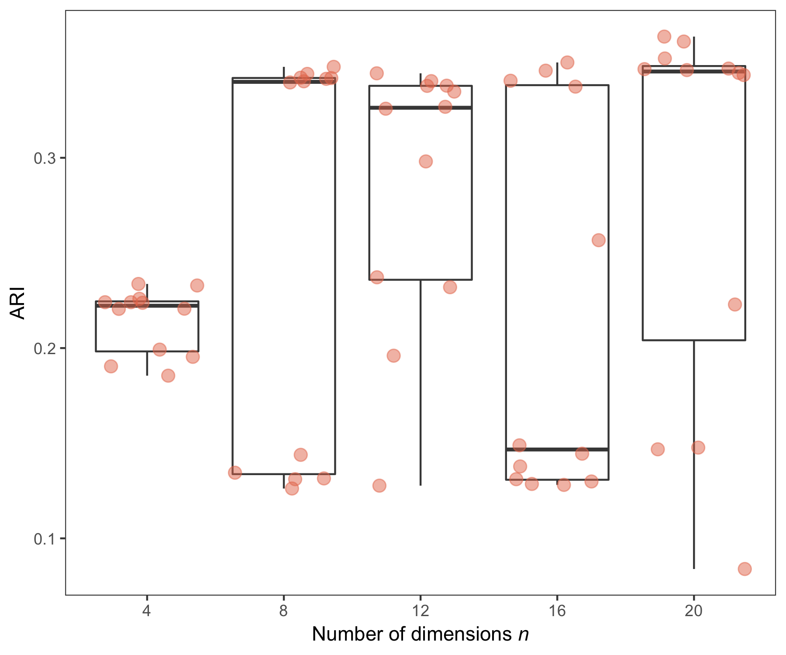

# Data

Data set size (total number of documents).

```bash
# medline
zcat brca_med_top4.txt.gz | cut -f4 | grep -v '|' |  wc -l
14075

# pmc
zcat brca_pmc_top4.txt.gz | cut -f5 | grep -v '|' |  wc -l
1682
```

Distribution of classes (MeSH terms).

```bash
# medline
zcat brca_med_top4.txt.gz | cut -f4 | grep -v '|' |  sort | uniq -c 
   1653 Breast Neoplasms, Male
   8644 Carcinoma, Ductal, Breast
   1341 Carcinoma, Lobular
   2437 Triple Negative Breast Neoplasms

# pmc
zcat brca_pmc_top4.txt.gz | cut -f5 | grep -v '|' |  sort | uniq -c 
    124 Breast Neoplasms, Male
    687 Carcinoma, Ductal, Breast
     88 Carcinoma, Lobular
    783 Triple Negative Breast Neoplasms
```

# Experiments

## Parameters

Tested the combinations of the following parameters:

- Minimal document frequencies: words with document frequency equal or smaller than df are ignored.
  - 10, 30, 50, 70, 100
- R: Parameter for VCGS.
  - 5, 6, 7, 8, 9, 10
- D: Parameter for VCGS.
  - 0.05, 0.10, 0.15, 0.20, 0.25, 0.30, 0.35, 0.40, 0.45, 0.55
- Number of components (dimensions) for SVD: 
  - 0, 4, 8, 12, 16, 20
  - When set to 0, SVD is not applied.
- Clustering algorithms: 
  - kNN or maximin
- Number of clusters for kNN: 
  - 4
- Theta for maximin:
  - 0.8, 0.9, 0.99
  
## Abstracts (larger data)

Run an evaluation script for medline data created above. Different combinations of parameters are executed. (It takes about a couple of hours to complete.)

```bash
nice python eval.py --input brca_med_top4.txt.gz --output brca_med_top4_eval_sgl.csv --single
```

The resulting file has a set of given parameters and evaluation metric values for each line in the following order:

> df,r,d,n,alg,k,c,h,vd,v,ari,ami,fms,prec

where 

- df is the minimal document frequency
- r and d are VCGS's parameters
- n is the number of dimensions for SVD
- alg is an clustering algorithm (kmeans or maximin)
- k is the number of clusters. This is set beforehand for kNN but is determined by the algorithm for maximin. 
- the rest are evaluation measures: c = completeness, h = homogeneity, vd = v-measure-d, v = v-measure, ari = adjusted rand index, ami = adjusted mutual information, and fms = Fowlkes-Mallows index.  
- Precision is a variant of homogeneity (from Javed's JASIST paper)

Notes:

- v-measure-d and v-measure are different in how to treat multi-label cases.  The former treats (A, M1) and (A, M2) with evenly divided importance in evaluation, and the latter treats them as independent instances in evaluation.
- When df is greater than 1 (e.g., 10), VCGS is not applied, meaning that terms with document frequencies greater than this parameter are all treated as keywords.  This is for investigating the effectiness of VCGS in comparison with DF-based feature selection.

Now let's look at the five best parameter combinations based on adjusted rand index (ARI).

```bash
less brca_med_top4_eval_sgl.csv | sort -t',' -k11 -nr | head
1,6,0.25,0,kmeans,4,0.4203,0.3812,0.3998,0.3998,0.3726,0.3810,0.6608,0.8236
1,5,0.20,0,kmeans,4,0.4236,0.3772,0.3990,0.3990,0.3713,0.3770,0.6636,0.8252
1,9,0.15,0,kmeans,4,0.3973,0.3685,0.3824,0.3824,0.3709,0.3683,0.6556,0.7971
1,8,0.20,0,kmeans,4,0.3950,0.3634,0.3786,0.3786,0.3626,0.3632,0.6524,0.7989
1,10,0.30,0,kmeans,4,0.3940,0.3647,0.3788,0.3788,0.3613,0.3645,0.6502,0.7992
1,5,0.10,0,kmeans,4,0.3959,0.3597,0.3769,0.3769,0.3612,0.3595,0.6544,0.8026
1,6,0.15,0,kmeans,4,0.4016,0.3575,0.3783,0.3783,0.3592,0.3573,0.6569,0.8099
1,8,0.30,0,kmeans,4,0.4035,0.3642,0.3828,0.3828,0.3586,0.3640,0.6537,0.8155
1,7,0.30,0,kmeans,4,0.4043,0.3662,0.3843,0.3843,0.3581,0.3660,0.6526,0.8177
1,5,0.15,0,kmeans,4,0.3962,0.3596,0.3770,0.3770,0.3569,0.3594,0.6521,0.8074
```

Observations:

- df = 1 dominates the top 10, which means VCGS is better than DF-based feature selection.
- kmeans works better than maximin.
- Good r and d values seem more or less random and may be difficult to find optimum settings.  More investigation is needed to see how sensitive the performance is to these parameters.
- SVD does not give much advantage especially when we look at the cases with n=4.
- k = 4 and 6 produced high ARI, which are the same as or close to the same number of underlying classes (mesh terms)

Based on the first observation above, let's see how good the DF-based feature selection is.  The following shows the five best results in ari where minimum DF was set to other than 1.

```bash
less brca_med_top4_eval_sgl.csv | grep -vP '^1,' | sort -t',' -k11 -nr | head
100,na,na,20,kmeans,4,0.3676,0.3484,0.3577,0.3577,0.3374,0.3482,0.6311,0.7863
30,na,na,8,maximin,5,0.2145,0.2931,0.2477,0.2477,0.2161,0.2143,0.4821,0.6679
70,na,na,0,kmeans,4,0.2722,0.2835,0.2778,0.2778,0.2037,0.2720,0.5263,0.7058
50,na,na,0,kmeans,4,0.2693,0.2821,0.2756,0.2756,0.1978,0.2691,0.5209,0.7083
10,na,na,20,kmeans,4,0.2622,0.2721,0.2671,0.2671,0.1934,0.2620,0.5205,0.7104
30,na,na,20,kmeans,4,0.2619,0.2721,0.2669,0.2669,0.1900,0.2617,0.5179,0.7089
30,na,na,8,maximin,3,0.2165,0.2129,0.2147,0.2147,0.1880,0.2128,0.5080,   nan
30,na,na,8,maximin,3,0.2165,0.2129,0.2147,0.2147,0.1880,0.2128,0.5080,   nan
10,na,na,16,kmeans,4,0.2589,0.2705,0.2646,0.2646,0.1863,0.2587,0.5137,0.7131
50,na,na,20,kmeans,4,0.2598,0.2715,0.2655,0.2655,0.1854,0.2596,0.5133,0.7098
```

The best ari was found to be 0.1410, which is pretty low.  So VCGS does work!  

Just out of curiosity, what if we look at v-measure-d or ami?

```bash
# v-measure
less brca_med_top4_eval_sgl.csv | sort -t',' -k10 -nr | grep ',4,0' | head -5
1,6,0.25,0,kmeans,4,0.4203,0.3812,0.3998,0.3998,0.3726,0.3810,0.6608,0.8236
1,5,0.20,0,kmeans,4,0.4236,0.3772,0.3990,0.3990,0.3713,0.3770,0.6636,0.8252
1,8,0.55,12,kmeans,4,0.4035,0.3774,0.3900,0.3900,0.3270,0.3773,0.6275,0.8467
1,6,0.45,20,kmeans,4,0.4036,0.3735,0.3880,0.3880,0.3238,0.3733,0.6282,0.8459
1,6,0.35,20,kmeans,4,0.4067,0.3666,0.3856,0.3856,0.3337,0.3664,0.6397,0.8404

# ami
less brca_med_top4_eval_sgl.csv | sort -t',' -k12 -nr | grep ',4,0' | head -5
1,6,0.25,0,kmeans,4,0.4203,0.3812,0.3998,0.3998,0.3726,0.3810,0.6608,0.8236
1,8,0.55,12,kmeans,4,0.4035,0.3774,0.3900,0.3900,0.3270,0.3773,0.6275,0.8467
1,5,0.20,0,kmeans,4,0.4236,0.3772,0.3990,0.3990,0.3713,0.3770,0.6636,0.8252
1,6,0.45,20,kmeans,4,0.4036,0.3735,0.3880,0.3880,0.3238,0.3733,0.6282,0.8459
1,7,0.55,12,kmeans,4,0.3911,0.3700,0.3802,0.3802,0.3040,0.3698,0.6115,0.8493
```

Observations:

- Overall, we see similar patterns to ari.
  - df = 1 still works better (VCGS is better).
  - kmeans still works better.
  - LSA is not effective (nor harmful).

## Full texts vs. abstracts (smaller data)

The aim of the following experiments is to show, if any, the advantage of full-text data over abstracts for clustering biomedical articles.  First, run eval.py script. (We can run them in parallel as follows. Takes less than an hour on miksa3.)

```bash
nice python eval.py --input brca_pmc_top4.txt.gz --output brca_med_top4_eval_sgl.csv --single &
nice python eval.py --input brca_pmc_top4.txt.gz --fields title,abstract --output brca_top4_eval_ta_sgl.csv --single &
nice python eval.py --input brca_pmc_top4.txt.gz --fields title --output brca_top4_eval_t_sgl.csv --single &
```

Let's look at the result based on ARI.

```bash
# Evaluation for title+abstract+fulltext
less brca_top4_eval_all_sgl.csv | sort -t',' -k11 -nr | head 
1,6,0.08,8,kmeans,4,0.3853,0.3094,0.3432,0.3432,0.3999,0.3076,0.6559
1,8,0.08,4,kmeans,4,0.3311,0.3124,0.3215,0.3215,0.3934,0.3107,0.6370
1,6,0.08,0,kmeans,2,0.4437,0.2871,0.3486,0.3486,0.3887,0.2865,0.6626
1,9,0.08,4,kmeans,4,0.3227,0.3073,0.3148,0.3148,0.3858,0.3055,0.6311
1,10,0.08,4,kmeans,4,0.3180,0.3066,0.3122,0.3122,0.3787,0.3048,0.6254
1,7,0.08,8,kmeans,4,0.3678,0.2960,0.3280,0.3280,0.3772,0.2941,0.6426
1,7,0.08,0,kmeans,2,0.4299,0.2780,0.3376,0.3376,0.3744,0.2774,0.6546
1,8,0.08,12,kmeans,4,0.3801,0.3158,0.3450,0.3450,0.3707,0.3140,0.6357
1,9,0.08,8,kmeans,4,0.3449,0.2759,0.3065,0.3065,0.3560,0.2739,0.6310
1,7,0.08,12,kmeans,4,0.3531,0.2771,0.3105,0.3105,0.3468,0.2751,0.6277

# Evaluation for title+abstract.
less brca_top4_eval_ta_sgl.csv | sort -t',' -k11 -nr | head 
1,5,0.14,4,kmeans,2,0.4284,0.2776,0.3368,0.3368,0.3698,0.2770,0.6515
1,5,0.14,0,kmeans,2,0.4060,0.2596,0.3167,0.3167,0.3244,0.2590,0.6290
1,10,0.01,20,kmeans,4,0.3431,0.2997,0.3200,0.3200,0.3189,0.2979,0.6025
1,5,0.14,8,kmeans,2,0.3852,0.2458,0.3001,0.3001,0.3059,0.2451,0.6191
100,na,na,0,kmeans,2,0.3694,0.2331,0.2858,0.2858,0.2904,0.2324,0.6129
100,na,na,12,kmeans,2,0.3740,0.2349,0.2886,0.2886,0.2878,0.2343,0.6126
70,na,na,12,kmeans,2,0.3692,0.2331,0.2858,0.2858,0.2861,0.2325,0.6104
70,na,na,8,kmeans,2,0.3578,0.2274,0.2781,0.2781,0.2839,0.2267,0.6076
70,na,na,0,kmeans,2,0.3747,0.2355,0.2893,0.2893,0.2821,0.2349,0.6093
1,8,0.08,0,kmeans,2,0.3618,0.2306,0.2817,0.2817,0.2817,0.2299,0.6058

# Evaluation for title.
70,na,na,4,kmeans,4,0.3182,0.3560,0.3360,0.3360,0.2708,0.3166,0.5421
100,na,na,4,kmeans,4,0.3048,0.3681,0.3334,0.3334,0.2669,0.3033,0.5220
100,na,na,0,kmeans,4,0.2920,0.3545,0.3202,0.3202,0.2644,0.2905,0.5188
50,na,na,4,kmeans,4,0.3228,0.3405,0.3314,0.3314,0.2476,0.3212,0.5402
70,na,na,20,kmeans,4,0.3111,0.3444,0.3269,0.3269,0.2463,0.3095,0.5301
100,na,na,8,kmeans,4,0.2923,0.3511,0.3190,0.3190,0.2457,0.2907,0.5096
100,na,na,12,kmeans,4,0.2886,0.3461,0.3147,0.3147,0.2394,0.2870,0.5060
1,5,0.21,8,maximin,5,0.1697,0.2237,0.1930,0.1930,0.2287,0.1676,0.4871
70,na,na,16,kmeans,4,0.3079,0.3366,0.3216,0.3216,0.2255,0.3063,0.5212
50,na,na,12,kmeans,4,0.3112,0.3252,0.3181,0.3181,0.2251,0.3095,0.5294
```

Observations:

- Using all fields (title+abstract+fulltext) achieved the best performance in ARI, followed by title+abs, then title.
- When using only titles, DF-based feature selection worked better than VCGS. This would be due to the small number of words from titles (therefore not many keywords were identified by VCGS).  This tendency is also seen in title+abstract.
- kmeans generally works better than maximin.
- LSA's effectiveness is not very clear.

Since we know there're four underlying classes, it would be more appropriate to compare the three cases above only for four clusters (i.e., only look at k=4).

```bash
# Evaluation for title+abstract+fulltext
less brca_top4_eval_all_sgl.csv | grep ",4,0." | sort -t',' -k11 -nr | head
1,6,0.08,8,kmeans,4,0.3853,0.3094,0.3432,0.3432,0.3999,0.3076,0.6559
1,8,0.08,4,kmeans,4,0.3311,0.3124,0.3215,0.3215,0.3934,0.3107,0.6370
1,9,0.08,4,kmeans,4,0.3227,0.3073,0.3148,0.3148,0.3858,0.3055,0.6311
1,10,0.08,4,kmeans,4,0.3180,0.3066,0.3122,0.3122,0.3787,0.3048,0.6254
1,7,0.08,8,kmeans,4,0.3678,0.2960,0.3280,0.3280,0.3772,0.2941,0.6426
1,8,0.08,12,kmeans,4,0.3801,0.3158,0.3450,0.3450,0.3707,0.3140,0.6357
1,9,0.08,8,kmeans,4,0.3449,0.2759,0.3065,0.3065,0.3560,0.2739,0.6310
1,7,0.08,12,kmeans,4,0.3531,0.2771,0.3105,0.3105,0.3468,0.2751,0.6277
1,9,0.08,20,kmeans,4,0.3291,0.2577,0.2891,0.2891,0.3362,0.2557,0.6214
1,5,0.01,0,kmeans,4,0.3724,0.3243,0.3467,0.3467,0.3277,0.3226,0.6104

# Evaluation for title+abstract.
less brca_top4_eval_ta_sgl.csv | grep ",4,0." | sort -t',' -k11 -nr | head 
1,10,0.01,20,kmeans,4,0.3431,0.2997,0.3200,0.3200,0.3189,0.2979,0.6025
1,9,0.01,20,kmeans,4,0.3326,0.3348,0.3337,0.3337,0.2756,0.3309,0.5589
1,7,0.01,0,kmeans,4,0.3205,0.3433,0.3315,0.3315,0.2729,0.3188,0.5486
1,5,0.14,20,kmeans,4,0.3744,0.3790,0.3767,0.3767,0.2725,0.3728,0.5590
1,9,0.01,16,kmeans,4,0.3353,0.3302,0.3327,0.3327,0.2713,0.3284,0.5607
1,8,0.01,16,kmeans,4,0.3381,0.3346,0.3364,0.3364,0.2710,0.3329,0.5594
1,8,0.01,20,kmeans,4,0.3339,0.3279,0.3309,0.3309,0.2703,0.3262,0.5604
1,8,0.08,20,kmeans,4,0.3353,0.3378,0.3366,0.3366,0.2660,0.3336,0.5535
1,5,0.14,12,kmeans,4,0.3721,0.3776,0.3748,0.3748,0.2659,0.3705,0.5555
1,5,0.14,0,kmeans,4,0.3478,0.3667,0.3570,0.3570,0.2648,0.3462,0.5453


# Evaluation for title.
less brca_top4_eval_t_sgl.csv | grep ",4,0." | sort -t',' -k11 -nr | head
70,na,na,4,kmeans,4,0.3182,0.3560,0.3360,0.3360,0.2708,0.3166,0.5421
100,na,na,4,kmeans,4,0.3048,0.3681,0.3334,0.3334,0.2669,0.3033,0.5220
100,na,na,0,kmeans,4,0.2920,0.3545,0.3202,0.3202,0.2644,0.2905,0.5188
50,na,na,4,kmeans,4,0.3228,0.3405,0.3314,0.3314,0.2476,0.3212,0.5402
70,na,na,20,kmeans,4,0.3111,0.3444,0.3269,0.3269,0.2463,0.3095,0.5301
100,na,na,8,kmeans,4,0.2923,0.3511,0.3190,0.3190,0.2457,0.2907,0.5096
100,na,na,12,kmeans,4,0.2886,0.3461,0.3147,0.3147,0.2394,0.2870,0.5060
70,na,na,16,kmeans,4,0.3079,0.3366,0.3216,0.3216,0.2255,0.3063,0.5212
50,na,na,12,kmeans,4,0.3112,0.3252,0.3181,0.3181,0.2251,0.3095,0.5294
70,na,na,12,kmeans,4,0.3001,0.3287,0.3138,0.3138,0.2214,0.2985,0.5181
```

Observations:

- The tendency (fulltext > abstract > title) didn't change.
- kmeans performs better than maximin.
- LSA generally helps.
- R is less sensitive than D, which means it's difficult to find good D value).
- VCGS doesn't work for titles (only).  If we look at the cases where VCGS was used... 

```bash
less brca_top4_eval_t_sgl.csv | grep ",4,0." | grep -P '^1,' | sort -t',' -k11 -nr | head
1,7,0.53,0,kmeans,4,0.2583,0.2690,0.2636,0.2636,0.2003,0.2565,0.5099
1,9,0.47,0,kmeans,4,0.2669,0.2738,0.2703,0.2703,0.1968,0.2651,0.5125
1,10,0.47,0,kmeans,4,0.2667,0.2729,0.2698,0.2698,0.1949,0.2649,0.5123
1,6,0.40,8,maximin,4,0.1588,0.1871,0.1718,0.1718,0.1913,0.1570,0.4762
1,8,0.21,0,kmeans,4,0.2379,0.2503,0.2439,0.2439,0.1793,0.2361,0.4925
1,7,0.21,0,kmeans,4,0.2371,0.2493,0.2430,0.2430,0.1775,0.2352,0.4916
1,6,0.21,0,kmeans,4,0.2350,0.2478,0.2413,0.2413,0.1773,0.2332,0.4911
1,8,0.53,12,kmeans,4,0.2373,0.2422,0.2398,0.2398,0.1654,0.2354,0.4951
1,6,0.60,16,kmeans,4,0.2427,0.2461,0.2444,0.2444,0.1651,0.2408,0.4982
1,10,0.01,8,maximin,4,0.1334,0.1521,0.1421,0.1421,0.1647,0.1315,0.4640
```

What if the results are sorted by adjusted mutual information?

```bash
less brca_top4_eval_all_sgl.csv | grep ",4,0." | sort -t',' -k12 -nr | head -5
1,10,0.40,20,kmeans,4,0.3341,0.3410,0.3375,0.3375,0.2403,0.3324,0.5426
1,10,0.60,20,kmeans,4,0.3512,0.3320,0.3414,0.3414,0.2294,0.3303,0.5494
1,10,0.53,12,kmeans,4,0.3326,0.3315,0.3320,0.3320,0.2228,0.3298,0.5366
1,7,0.40,0,kmeans,4,0.3300,0.3494,0.3394,0.3394,0.2150,0.3283,0.5189
1,5,0.01,0,kmeans,4,0.3724,0.3243,0.3467,0.3467,0.3277,0.3226,0.6104

less brca_top4_eval_ta_sgl.csv | grep ",4,0." | sort -t',' -k12 -nr | head -5
1,5,0.14,20,kmeans,4,0.3744,0.3790,0.3767,0.3767,0.2725,0.3728,0.5590
1,5,0.14,12,kmeans,4,0.3721,0.3776,0.3748,0.3748,0.2659,0.3705,0.5555
1,5,0.14,16,kmeans,4,0.3690,0.3704,0.3697,0.3697,0.2564,0.3674,0.5526
1,5,0.21,12,kmeans,4,0.3683,0.3773,0.3727,0.3727,0.2519,0.3667,0.5458
1,5,0.27,16,kmeans,4,0.3681,0.3773,0.3726,0.3726,0.2205,0.3665,0.5286

less brca_top4_eval_t_sgl.csv | grep ",4,0." | sort -t',' -k12 -nr | head -5
50,na,na,4,kmeans,4,0.3228,0.3405,0.3314,0.3314,0.2476,0.3212,0.5402
70,na,na,4,kmeans,4,0.3182,0.3560,0.3360,0.3360,0.2708,0.3166,0.5421
70,na,na,20,kmeans,4,0.3111,0.3444,0.3269,0.3269,0.2463,0.3095,0.5301
50,na,na,12,kmeans,4,0.3112,0.3252,0.3181,0.3181,0.2251,0.3095,0.5294
50,na,na,20,kmeans,4,0.3104,0.3690,0.3372,0.3372,0.2009,0.3089,0.4826
```

Observations:

- The tendency changed (abstract > fulltext > title).


# Evaluation metrics

To see the difference among different evaluation metrics empirically, the following shows Pearson's correlation coefficient between every pair of metrics **by R**, not python.

```R
cls <- c(ari="numeric", ami="numeric", vd="numeric",v="numeric",fms="numeric") 
x = read.csv("brca_med_top4_eval_sgl.csv",header=TRUE,colClasses=cls) 
cor(x[,9:13])
           vd         v       ari       ami       fms
vd  1.0000000 1.0000000 0.7603266 0.9333792 0.3347924
v   1.0000000 1.0000000 0.7603266 0.9333792 0.3347924
ari 0.7603266 0.7603266 1.0000000 0.7269075 0.7756461
ami 0.9333792 0.9333792 0.7269075 1.0000000 0.3483514
fms 0.3347924 0.3347924 0.7756461 0.3483514 1.0000000
```

ami and vd (or v) are found to be strongly correlated.  ari has relatively strong correlation with the three but it's not as strong as theirs.  On the other hand, fms has very weak to moderate correlations with the others.  The following shows the scatter plot for each pair of metrics, again by R.

```R
plot(x[,9:13])
```



Focusing on only V-measure, ARI and AMI...

```R
panel.cor <- function(x, y, digits = 3, cex.cor, ...)
{
 usr <- par("usr"); on.exit(par(usr))
 par(usr = c(0, 1, 0, 1))
 # correlation coefficient
 r <- cor(x, y)
 txt <- format(c(r, 0.123456789), digits = digits)[1]
 txt <- paste("r = ", txt, sep = "")
 text(0.5, 0.6, txt, cex=1.5)

 # p-value calculation
 p <- cor.test(x, y)$p.value
 txt2 <- format(c(p, 0.123456789), digits = digits)[1]
 txt2 <- paste("p = ", txt2, sep = "")
 if(p<0.01) txt2 <- expression(paste(p <= 0.01, sep = ""))
 text(0.5, 0.4, txt2, cex=1.5)
}
quartz("",6,5) # this is for Mac
par(mar=c(5,4,1,1))
pairs(x[,c(10,11,12)], upper.panel = panel.cor)
```


How do r and d affect cluster quality? Note that P is used to refer to d below.

```R
cls <- c(r="numeric", d="numeric", n="numeric", ari="numeric", ami="numeric", vd="numeric",v="numeric",fms="numeric") 
x = read.csv("brca_med_top4_eval_sgl.csv",header=TRUE,colClasses=cls,na.strings="na")
x[x$df == 1 & x$alg == "kmeans" & x$n > 0 & x$k == 4, c(2,3,4,11)] -> y
colnames(y) = c("R", "P", "n", "ARI")

library(magrittr) # for pipe operator
library(dplyr)    # for grouping

# compute mean by group
ag <- y %>% 
        group_by(R, P) %>% 
        summarise(ARI = mean(ARI))

# plot
quartz("",6,5) # this is for Mac
par(mar=c(5,4,1,1))
sp = ggplot(data=ag, mapping=aes(x=factor(R), y=factor(P), color=ARI)) + geom_point(alpha=.9, size=ag$ARI*40)
sp+scale_color_gradient(low="white", high="red") + theme_bw() + theme(panel.grid=element_blank()) + labs(x=expression(italic(R)),y=expression(italic(P)))
```



How about n (number of dimensions)?

```R
cls <- c(r="numeric", d="numeric", n="numeric", ari="numeric", ami="numeric", vd="numeric",v="numeric",fms="numeric") 
x = read.csv("brca_med_top4_eval_sgl.csv",header=TRUE,colClasses=cls,na.strings="na")
x[x$df == 1 & x$alg == "kmeans" & x$n > 0 & x$k == 4, c(2,3,4,11)] -> y
colnames(y) = c("R", "P", "n", "ARI")

quartz("",6,5) # this is for Mac
par(mar=c(5,4,1,1))

sp2 = ggplot(data=y, mapping=aes(x=factor(n), y=ARI)) + geom_boxplot()
sp2 + geom_jitter(alpha=.5, color="tomato", height=0) + theme_bw() + theme(panel.grid=element_blank()) + labs(x=expression(paste("Number of dimensions ", italic(n))))
```



What if we look at only a certain range of r and d?

```R
cls <- c(r="numeric", d="numeric", n="numeric", ari="numeric", ami="numeric", vd="numeric",v="numeric",fms="numeric") 
x = read.csv("brca_med_top4_eval_sgl.csv",header=TRUE,colClasses=cls,na.strings="na")
x[x$df == 1 & x$alg == "kmeans" & x$n > 0 & x$k == 4 & x$d >= 0.08 & x$d <= 0.21 & x$r <= 8, c(2,3,4,11)] -> y
colnames(y) = c("R", "P", "n", "ARI")

quartz("",6,5) # this is for Mac
par(mar=c(5,4,1,1))

sp3 = ggplot(data=y, mapping=aes(x=factor(n), y=ARI)) + geom_boxplot()
sp3 + geom_jitter(alpha=.5, color="tomato", height=0, size=3) + theme_bw() + theme(panel.grid=element_blank()) + labs(x=expression(paste("Number of dimensions ", italic(n))))
```


